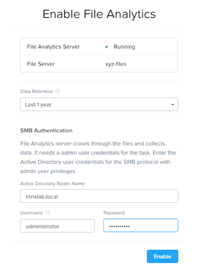

.. _file_analytics_deploy:

Lab 10
----------------------

Overview
++++++++

In this exercise you will deploy the File Analytics VM and scan the existing shares to build out the dashboard.  You will also create anomaly alerts and view the audit details for your file server instance.

Deploy File Analytics
+++++++++++++++++++++

#. In **Prism** > **File Server** > click **Deploy File Analytics**

   |image107|

#. Select **Deploy**

#. After the upload completes select **Install**

#. Fill out the details

   - **Name** - Initials
   - **Storage Container** – Will automatically select the container used by your file server instance
   - **Network List** – Network-01

#. Select **Show Advanced Settings**

#. Ensure **DNS Resolver IP** is set to your Active Directory, spoc014-1.nutanix.local, domain controller/DNS IP address.

#. Choose **Deploy**

#. You can monitor the deployment from the **Tasks** page.  The Analytics VM deployment should take ~5 minutes.

#. In **Prism** > **File Server** > click **File Analytics**

   |image108|

#. On the Enable File Analytics page enter your domain administrator which is also your file server administrator.

   - **Username**: administrator
   - **Password**: nutanix/4u

   |image109|

#. Select **Enable**

