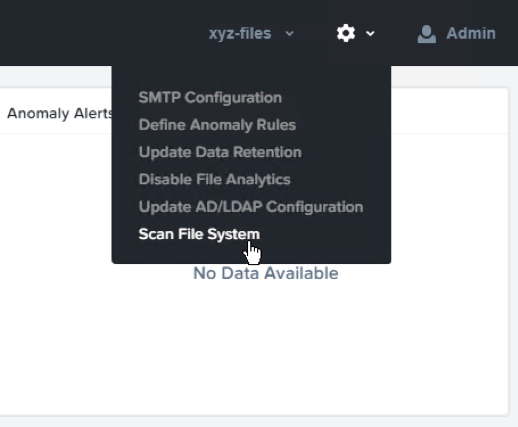
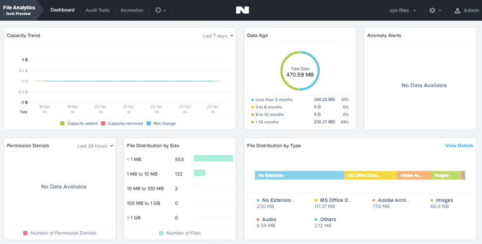
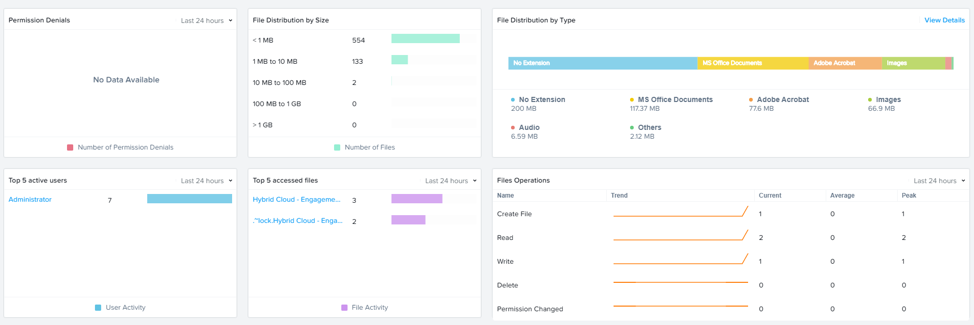

.. _file_analytics_scan:

Lab 11
--------------------------------

Overview
++++++++

File Analytics Scan
+++++++++++++++++++++

#. Analytics will perform an initial scan of the existing shares which will take just a couple minutes.  You can see the scan by going to the gear icon within the Analytics UI and selecting **Scan File System**

   |image110|

#. Choose **Cancel** to exit the scan details window

#. After viewing the scan details, refresh your browser.  You should see the **Data Age**, **File Distribution by Size** and **File Distribution by Type** dashboard panels update.

   |image111|

#. Create some audit trail activity by going to the marketing share and opening one of the word files under **Sample Data** > **Documents**

   .. note:: You may need to complete a short wizard for OpenOffice if using that application to open a file. http://10.42.194.11/users/OGR/Apache_OpenOffice_4.1.7_Win_x86_install_en-US.exe

#. Refresh the **Dashboard** page in your browser to see the **Top 5 active users**, **Top 5 accessed files** and **File Operations** panels update

   |image112|

#. Click on your user under **Top 5 active users**.  This will take you to the audit trail of the user.

#. You can also click on the **Audit Trails** menu and search for either your user or a given file.  You can use wildcards for your search, for example **.doc**

   |image113|

Takeaways
+++++++++

What are the key things you should know about **Nutanix File Analytics**?

- File Analytics helps you better understand how data is utilized by your organizations to help you meet your data auditing, data access minimization and compliance requirements.

