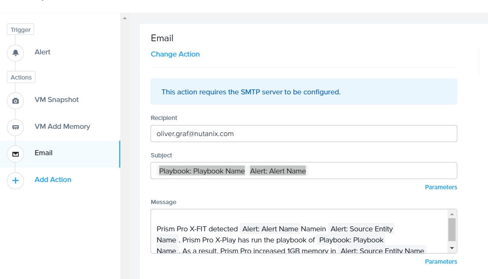
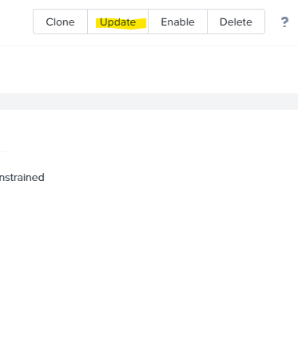
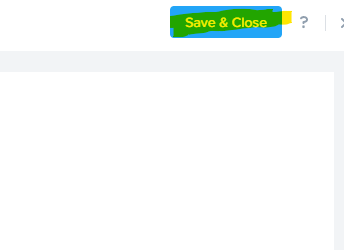

.. _prism_pro_xplay:

Lab 12
---------------

1CD comes with a complete XPLAY demo.  Very simple way of showing
horizontal scaling with CALM and Prism Pros XPlay.

Follow the prism central unlock procedure if this demo is executed prior
5.11.

The demo is already prepped, you will be working with the first IIS VM
deployed.

 - .. raw:: html

           <video controls src="images/X-PlayIIS.mp4" width="320" height="320"> </video>   

+-----------------------------------------------------+----------+---+
| .. rubric:: **Learning XPlay**                      |          |   |
|    :name: learning-xplay                            |          |   |
+=====================================================+==========+===+
| -  First step of this demo is to understand what    | |image01||   |
|    X-Play is.                                       |          |   |
|                                                     |          |   |
| -  In short its a operations automation system for  |          |   |
|    Nutanix.                                         |          |   |
|                                                     |          |   |
| -  Respond Automatically to events in the platform  |          |   |
|    and take alerting or remediation actions.        |          |   |
|                                                     |          |   |
| -  If Alert A Triggers Notify B and Execute Add     |          |   |
|    more memory.                                     |          |   |
|                                                     |          |   |
| -  This logic is stored in a playbook.              |          |   |
|                                                     |          |   |
| -  Playbooks are constructs to follow a certain     |          |   |
|    process.                                         |          |   |
+-----------------------------------------------------+----------+---+

-  You define an Alert, as a trigger, add possible constraints.

-  And choose step by step actions on the process to be executed against
   this event.

-  There are 5 built-in Examples (pre 5.11)

|image3|

-  Also check the Action Gallery page.

-  This page contains all the 1-click built in functions to use.

-  REST API is already allowing all the flexibility with things like
   CALM.

|image4|

.. _x-play-demo-1:

**X-Play Demo**
===============

-  Do try this at home first.

-  **Get a clean alert view in Prism Central. Clear the history. Resolve
   all open Alerts.**

-  Login to the IIS Webserver with RDP, capturing the IP from Prism
   Element / Central

-  The VM has a dynamic name prefixed with IIS

-  This server is joined to the domain.

-  Use the credentials that come with 1CD POCname\Administrator or SE
   UPN found on the Access details link on the `Live
   Status <http://1-click-com.corp.nutanix.com/Running.ps1x>`__ page

|image5|

|image6|

|image7|

-  One on the box download a tool called
   `HeavyLoad <https://www.jam-software.com/heavyload/>`__

-  Copy it to the remote desktop

-  Install the load generating tool

-  And press play. Note the CPU load on the VM

|image8|\ |image9|

-  Wait till the alert policy is being triggered. **This can take up to
   6 minutes.**

-  Open up the machine metrics page

-  Change Filter to 24H

-  | The Alert Appears (after 5 minutes)
   | Use the time to talk about the features of XPlay

-  The alert is triggered.

-  Show the alert from the alerts view or follow this link

|image10|

-  The playbook is executed

-  Zoom in to the details of the execution to show the detailed log.

|image11|

|image12|

-  Open Calm on the Applications page

-  The Calm blueprint is Executed and second webserver is beeing built.

-  The webserver is being added to the farm and to the load balancer.

|image13|

.. |image0| image:: images/image01.png
.. |image1| image:: images/image02.png
.. |image2| image:: images/image03.png
.. |image3| image:: images/image04.png
.. |image4| image:: images/image05.png
.. |image5| image:: images/image06.png
.. |image6| image:: images/image07.png
.. |image7| image:: images/image08.png
.. |image8| image:: images/image09.png
.. |image9| image:: images/image10.png

.. |image13| image:: images/image14.png
.. |image14| image:: images/X-PlayIIS.mp4

