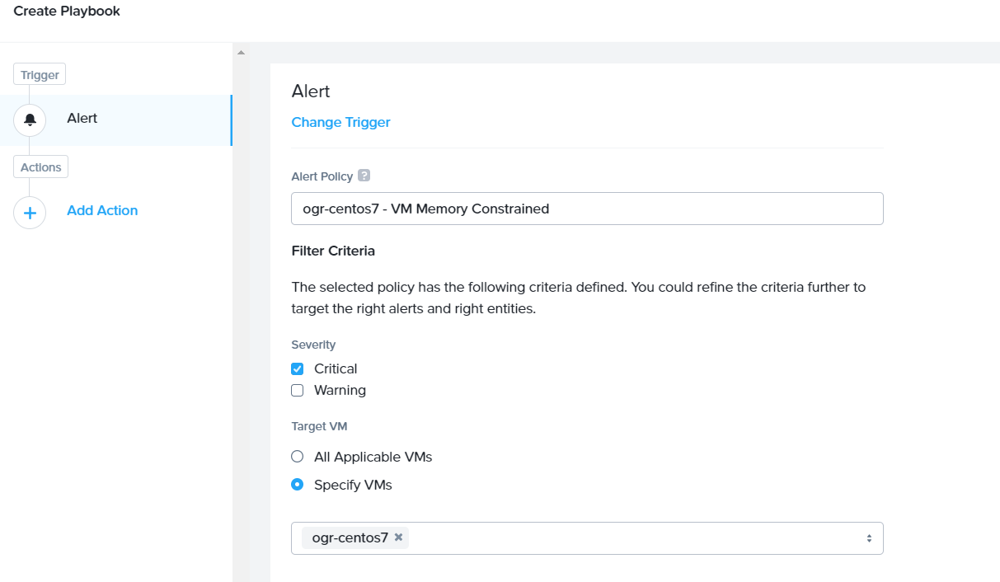

.. _prism_pro_xplay:

Lab 12
-----------------

*The estimated time to complete this lab is 60 minutes.*

Overview
========

Prism Pro is a product designed to make our customer IT operations smarter and automated through machine intelligence and automation. Today, there is no IT operations management (ITOM) solution that is specifically designed for the data center built around HCI. The modern data center is dynamic, scalable, and highly performant. Traditional ITOM, performance monitoring, and IT OPS tools are built for the static infrastructure. When being used in the modern data center, these tools can overwhelm IT admins with complexity and noisy signals. This decreases operational productivity and can reduce the ROI from adopting HCI.

Prism Pro takes a unique approach that maximizes the operational efficiency of a Nutanix based data center. Prism Pro uses purpose-buiut machine learning (X-Fit) to extract insights from massive amounts of operational data to guide capacity forecasting and planning, VM right-sizing, and anomaly detection - increasing productivity and eliminating waste.

In 5.11, Prism Pro introduces an automation mechanism (X-Play) that enables customers to automate operations and respond to signals generated by X-Fit.

X-Play is designed to address the #1 pain point when customers deal with automation, the fear of amplified impact because of complexity of the automation. Unlike solutions such as Calm, which focus on application lifecycle automation, X-Play’s goal is to automate infrastructure tasks that admins face daily. To eliminate the fear and give the control back to the admin, X-Play takes the codeless approach, a model proven by companies such as IFTTT and Zapier, making it versatile and easy to adopt.

The power of X-Fit and X-Play allows the customer to easily leverage machine data produced by their infrastructure, and operate it efficiently, confidently, and intelligently.

**In this lab you will create multiple different X-Play alert policies and playbooks to become familiar with the functionality and ease of use offered by this Prism Pro feature.**

Lab Setup
=========

This lab requires the already deployd CentOS7 VM

If you have not yet deployed this VM pleas go back to Lab 4

Automatically Add Memory to a VM When A Constraint is Detected
==============================================================

How often have you been on-call, and got that alert or service ticket for a VM that had high memory or CPU usage? Chances are a lot, and generally during dinner, while you are out with family, or sleeping.

What if you could use X-Play in Prism Pro to automatically take care of this for you when Prism Pro detected the constraint?

Good news, you can. Let’s walk through how to set that up.

Run Stress Test
===============

Lets add some load by initiating a stress test.

1. Login to the *Initials*\ **-centos7** via ssh or Console session.

   -  **Username** - root

   -  **password** - <password>

2. Execute the following to generate memory load:

.. code-block:: bash

   yum update -y
   yum install -y epel-release
   yum install -y stress   
   stress -m 4 --vm-bytes 500M -t 40m &

..

   Note

   It will take approximately 5 minutes for **stress** to generate the memory load to cause the alert.

Create Alert Policy
===================

1. In **Prism Central** > select **> Virtual Infrastructure > VMs**, and click *Initials*\ **-centos7**.

-----------

   |image01|

-----------

2. Select **Metrics > Memory Usage**.

-----------

   |image02|

-----------

3. Click **Alert Settings**

-----------

   |image03|
   |image04|

-----------

4. In the **Create Alert Policy** window, fill out the following fields:

   -  **Entity Type** - VM

   -  **Entity (Line 1)** - One VM

   -  **Entity (Line 2)** - *Initials*\ **-centos7**

   -  **Metric** - Memory Usage

   -  **Impact Type** - Performance

   -  **Policy Name** - *Initials* - VM Memory Constrained

   -  **Description** - Optional

   -  **Auto Resolve Alerts** - Checked

   -  **Enable Policy** - **Unchecked**

   -  **Trigger alert if conditions persist for** - 0 Minutes

   -  **Behavioral Anomaly**

      -  **Every time there is an anomaly, alert** - Checked / Warning

   -  **Static Threshold**

      -  **Alert Critical if** - Checked / >= 60

   |image05|

-----------

5. Click **Save**.

.. note::

   Customers can choose out-of-the-box alert policies (shown below) to detect the memory and cpu constraint by Prism Pro X-Fit.

Create Playbook
===============

1. In **Prism Central** go to the Searchbar and type Playbook

-----------

   |image06|

-----------

2. Click **Create Playbook**.

..

3. Select **Alert** as Trigger, and click **Select**.

-----------

   |image07|

-----------

4. Start typing to search for “VM Memory Constrained” in **Alert Policy**, and select *Initials* - **VM Memory Constrained**.

-----------

   |image08|

-----------

5. Click **Add Action**, and select the **VM Snapshot** action.

..

6. Select **Source Entity** from the parameters.

..

   Source entity refers to the entity that triggered the alert.

-  **Target VM** - Alert: Source Entity
-  **Time To Live** - 1 day(s)

-----------

   |image09|

-----------

7. Click **Add Action**, and select the **VM Add Memory** action.

..

8. Select **Source Entity** from the parameters.

   -  **Target VM** - Alert: Source Entity

   -  **Add Absolute Memory** - 1 GiB

   -  **Absolute Maximum** - 20 GiB

-----------

   |image10|

-----------

9. Click **Add Action**, and select the **Acknowledge Alert** action.

..

10. Select **Alert** from the parameters.

    -  **Target Alert** - Alert: Alert

..

11. Click **Save & Close**, and fill out the following fields:

    *  **Name** - *Initials* - Auto Remove Memory Constraint
    *  **Description** - Optional
    *  **Status** - Enabled

..

12. Click **Save**.

Cause Memory Constraint
=======================

1. In **Prism Central** > select **> Virtual Infrastructure > VMs**, and click *Initials*\ **-centos7**.

2. Take note of your *Initials*\ **-centos7** VM’s memory capacity (should be 2 GiB).

3. Click **Alerts**, Select **Alert Policy** from **Configure** drop-down menu.

4. Select *Initials* - **VM Memory Constrained**, and **Enable** the policy.

   After 2-5 minutes you should receive an email from Prism.

5. Verify that the memory capacity on your *Initials*\ **-centos7** VM has increased.

Review the Playbook Play
========================

1. In **Prism Central** > select **> Operations > Playbooks**.

2. Select your *Initials* - **Auto Remove Memory Constraint**, and **Disable** it.

3. Click **Plays**.

..

   You should see that a Play has just completed.

4. Click the Play, and examine the details.

Reset VM Memory
===============

1. Change your *Initials*\ **-centos7** memory back to 2GB you have to power off the vm to reduce the memory, as well add 2 more vcpus

Reduce CPU Capacity for a VM During a Maintenance Window 
------------------------------------------------------------------------------------------------------------------------------------------------------------------------------------------------------------------------------------------

X-Fit in Prism Pro utilizes Machine Learning to continually analyze the environment. This is helpful to detect resource constraints, such as our memory constraint in the last lab, or inefficiencies such as VMs with too many vCPUs or too much memory.

In this exercise we will create a playbook to take care of over-provisioned CPU.

Acknowledge and Resolve the Alert if there are any 

Go to **Prism Central**> select **Virtual Infrastructure**> **VMs** > *Initials*\ **-centos7** > **Alerts**

.. _create-alert-policy-1:

Create Alert Policy
===================

1. In **Prism Central** > select **> Activity > Alerts**, and select **Alert Policy** from **Configure** drop-down menu.

2. Click **+ New Alert Policy**.

3. In the **Create Alert Policy** window, fill out the following fields:

   -  **Entity Type** - VM

   -  **Entity (Line 1)** - One VM

   -  **Entity (Line 2)** - *Initials*\ **-centos7**

   -  **Metric** - CPU Usage

   -  **Impact Type** - Performance

   -  **Policy Name** - *Initials* - VM CPU Overprovisioned

   -  **Description** - Optional

   -  **Auto Resolve Alerts** - Checked

   -  **Enable Policy** - **Unchecked**

   -  **Trigger alert if conditions persist for** - 0 Minutes

   -  **Static Threshold**

      -  **Alert Critical if** - Checked / <= 30

4. Click **Save**.

.. _create-playbook-1:

Create Playbook
===============

1.  In **Prism Central** > select **> Operations > Playbooks**.

2.  Click **Create Playbook**.

3.  Select **Alert** as Trigger, and click **Select**.

4.  Start typing to search for “VM CPU Overprovisioned” in **Alert Policy**, and select *Initials* - **VM CPU Overprovisioned**.

5.  In many Environments, a production VM can not be powered off to alter the VM configuration. X-Play provides a way for the administrator to specify the time window where the actions can be executed. pleas choos **Wait until Day of Week** 

6.  Click **Add Action**, and select the **Power Off VM** action.

7.  Select **Source Entity** from the parameters.

    -  **Target VM** - Alert: Source Entity

    -  **Type of Power Off Action** - Power Off

8.  Click **Add Action**, and select the **VM Reduce CPU** action.

9.  Select **Source Entity** from the parameters.

    -  **Target VM** - Alert: Source Entity

    -  **vCPUs to Remove** - 1

    -  **Minimum Number of vCPUs** - 1

10.  Click **Add Action**, and select the **Power On VM** action.

11. Select **Source Entity** from the parameters.

    -  **Target VM** - Alert: Source Entity

12. Click **Add Action**, and select the **Email** action.

13. Click **Save & Close**, and fill out the following fields:

    -  **Name** - *Initials* - Reduce VM CPU

    -  **Description** - Optional

    -  **Status** - Enabled

14. Click **Save**.

Cause CPU Over-Provision
========================

1. In **Prism Central** > select **> Virtual Infrastructure > VMs**, and click *Initials*\ **-centos7**.

2. Take note of your *Initials*\ **-centos7** VM’s CPU Cores.

3. Click **Alerts**, select **Alert Policy** from **Configure** drop-down menu.

4. Select *Initials* - **VM CPU Overprovisioned**, and **Enable** the policy.

5. In **Prism Central** > select **> Operations > Playbooks**.

6. Select your *Initials* - **Reduce VM CPU -**, and click **Plays**.

..

   You should see that there is a Play with your initials in **Paused** status.

7.  you can now manualy resume or wait till the timer you set triggers.

8. Verify that the CPU cores on your *Initials*\ **-centos7** VM have been reduced.

..

Things to do Next
=================

As you can see, X-Play paired with X-Fit is very powerful. You can go to **Action Gallery** page and familiarize yourself with all the out-of-the-box Actions to see all the possible things you can do.

1. In **Prism Central** > select **> Operations > Actions Gallery**.

Use X-Play with Other Nutanix Products
======================================

Let’s see how we can use X-Play with other Nutanix products by creating a Playbook to automatically quarantine a bully VM.

1.  Login to the *Initials*\ **-centos7** via ssh or Console
    session:

    -  **Username** - root

    -  **password** - <password>

2.  Make sure NODE_PATH has the global nodejs module directory by running the following command to set it:

3.  export NODE_PATH=/usr/lib/node_modules

4.  Within *Initials*\ **-centos7**, download the `processapi.js <https://s3.amazonaws.com/handsonworkshops.prod.media/ws/c7322d4049734ea285178658664d8fee/d/file/ebfe7f3bbc8642d6901c70dac59e444e/e590e68a4a7177083c84e2b1ff2441a6/processapi.js>`__ file:

5.  curl -L https://s3.amazonaws.com/get-ahv-images/processapi.js -o processapi.js

6.  Modify the PC IP address and username/password in the script.

7.  sed -i 's/127.0.0.1/<*your PC IP*>/g' processapi.js

8.  

9.  sed -i 's/pc user/admin/g' processapi.js

10. 

11. sed -i 's/pc password/<*your PC password*>/g' processapi.js

12. Start the nodejs server

13. node processapi.js&

14. Run the stress command to simulate the IO load

15. stress -d 2

16. Keep stress running until you complete this exercise.

.. _create-alert-policy-2:

Create Alert Policy 
=====================

1. In **Prism Central** > select **> Activity > Alerts**, and Select **Alert Policy** from **Configure** drop-down menu.

2. Click **+ New Alert Policy**.

3. In the **Create Alert Policy** window, fill out the following fields:

   -  **Entity Type** - VM

   -  **Entity (Line 1)** - One VM

   -  **Entity (Line 2)** - *Initials*\ **-centos7**

   -  **Metric** - Controller IO Bandwidth

   -  **Impact Type** - Performance

   -  **Policy Name** - *Initials* - Bully VM

   -  **Description** - Optional

   -  **Auto Resolve Alerts** - Checked

   -  **Enable Policy** - **Unchecked**

   -  **Trigger alert if conditions persist for** - 0 Minutes

   -  **Behavioral Anomaly**

      -  **Every time there is an anomaly, alert** - Checked / Warning

   -  **Static Threshold**

      -  **Alert Critical if** - Checked / >= 250

4. Click **Save**.

.. Note::

   Customers can choose out-of-the-box alert policies (shown below) to detect the bully VM with X-Fit.

Create Custom REST API Action 
==============================

1. In **Prism Central** > select **> Operations > Actions Gallery**.

2. Select **REST API** action, and then select **Clone** from the **Action** dropdown.

3. Fill in the following fields:

   -  **Name** - *Initials* - Quarantine a VM

   -  **Description** - Quarantine a VM using Flow API

   -  **Method** - PUT

   -  **URL** - `https:// <NULL>`__\ *<your PC IP>*:9440/api/nutanix/v3/vms/{{trigger[0].source_entity_info.uuid}}

   -  **Request Headers** - Content-Type: application/json

4. Click **Copy**.

.. _create-playbook-2:

Create Playbook 
================

1. In **Prism Central** > select **> Operations > Playbooks**.

2. Click **Create Playbook**.

3. Select **Alert** as Trigger, and click **Select**.

4. Start typing to search for “Bully VM” in **Alert Policy**, and select *Initials* - **Bully VM**.

5. Click **Add Action**, and select the **REST API** action.

   -  **Method** - GET

   -  **URL** - `http:/ <NULL>`__/<IP of *Initial*-centos7>:3000/vm/{{trigger[0].source_entity_info.uuid}}

.. Note::

   There is a known issue in 5.10 where you have to click the “GET” in the drop list once even though “GET” is shown as the default value.

6. Click **Add Action**, and select the *Initials* - **Quarantine a VM** action.

.. Note::

   There is a known issue in 5.10 where the title of this action still shows as “REST API”. In 5.11 GA, you will see the title as you specified earlier.

7.  Click **Parameters** and select **Response Body** into the request body field.

8.  Specify the **Username** and **Password** for **Prism Central**.

9.  Click **Add Action**, and select the **Acknowledge Alert** action.

10. Select **Alert** from the parameters.

    -  **Target Alert** - {{trigger[0].alert_entity_info}}

11. Click **Save & Close**, and fill out the following fields:

    -  **Name** - *Initials* - Auto Quarantine A Bully VM

    -  **Description** - Optional

    -  **Status** - Enabled

12. Click **Save**.

Cause Bully VM Condition 
========================

1. In **Prism Central** > select **> Virtual Infrastructure > VMs**, and click *Initials*\ **-centos7**.

2. Click **Categories**, and make sure it is not currently quarantined and associated with any categories.

3. In **Prism Central** > select **> Activity > Alerts**, and select **Alert Policy** from **Configure** drop-down menu.

..

   Select *Initials* - **Bully VM**, and **Enable** the policy.

4. After 1-2 minutes check *Initials*\ **-centos7**, you should  now see the VM is quarantined.

Cleanup Bully VM Condition 
==========================

1. Un-quarantine your *Initials*\ **-centos7**.

2. In **Prism Central** > select **> Operations > Playbooks**.

3. Click the *Initials* - **Auto Quarantine A Bully VM** playbook, and
   click the **Disable** button.

4. Click the **Play** tab, you should see that a Play has just
   completed.

5. If the terminal session is broken (due to the quarantine), log in to
   *Initial*-**centos7** to kill the node and stress processes.

(Optional) Endless Possibilities Using APIs
===========================================

This exercise will show how you can easily include 3rd party tools into X-Play. Using `IFTTT <https://ifttt.com/>`__ you can easily send a Slack message when an alert is detected. This same functionality could be extended to SMS alerts, ServiceNow, or any other 3rd party tools.

1. Before we set up IFTTT, ensure your *Initial*-**centos7** has   2GB of memory assigned.

2. Log in to the *Initials*\ **-centos7** via ssh or Console session.

3. Run stress again to generate memory pressure:

4. stress -m 4 --vm-bytes 500M

.. Note::

   It will take roughly 5min for Stress to generate the memory load to cause the alert.

Setup IFTTT
===========

1. Register for a free account at https://ifttt.com/.

2. Log in and search for **Webhooks**.

3. Click on **Services > Webhooks**.

4. Click **Connect**.

5. Click the **Settings** button at the top right.

6. Copy the URL shown in the **Settings** (e.g. https://maker.ifttt.com/use/xxxxxyyyyzzz).

7. Paste that URL into a new browser tab, and go to the page. The page that opens will show your unique Webhook address (e.g. https://maker.ifttt.com/trigger/{event}/with/key/xxxxxyyyzzz).

..

   Take note of the address, as this is what we will be targeting in the X-Play REST API action later.

   Now you can create your own applet that will be triggered when it is called from X-Play.

8.  In a new browser tab, open https://ifttt.com/my_applets.

9.  Click **New Applet**.

10. Click **+this**.

..

   This is where you will set up the Webhook URL that X-Play can trigger.

11. Search and click **Webhooks**.

12. Click **Receive a web request**.

13. Fill your **event** name. This name will be part of the Webhook URL from earlier in the exercise:

..

   For example, if the event name is **xplay**, the Webhook URL you will use in X-Play will be something like this:

   https://maker.ifttt.com/trigger/xplay/with/key/xxxxxyyyzzz

14. Click **Create Trigger**.

..

   You can now create the **+that** to decide what you are going to do in this applet.

   You can use your imagination here. There are over 600 IFTTT services from which you can choose. For example, you can call your cell phone, send you an calendar event, send a text message, change the color of a Philips HUE LED lightbulb, or even open your garage door.

.. Note::

   If you are familiar with Zapier, you can also use that instead of IFTTT. Zapier can connect to over 1000 services, including Salesforce, PagerDuty, and many enterprise applications.

   For this lab we are using its Slack service as an example. You are free and **encouraged** to choose any other service in this step.

.. Note::

   X-Play also includes a native Slack action without requiring 3rd party services such as IFTTT.

15. Click **+that**.

16. Search and click **Slack**.

17. Click **Connect**.

18. When prompted, sign into Slack.

19. Click **Post to channel** and fill in the channel and message.

..

   You have three values can pass from from X-Play to IFTTT:

   In this example, Value 1 is the Alert name, Value 2 is the VM name, and Value 3 is the Playbook name.

20. Click **Add Ingredient** to specify **Values 1-3**.

21. Fill in the Following:

    -  **Which channel** - Direct Messages & @yourSlackHandle

    -  **Message** - Nutanix X-FIT just detected an issue of {{Value1}} in {{Value2}} VM. Playbook “{{Value3}}” has increased its memory by 1GB. – This message was sent by Prism Pro on {{OccurredAt}}.

    -  **Title** - Nutanix Prism Pro just fixed an issue for you.

22. Click **Create Action > Finish**.

..

   You now have an IFTTT applet that can be called from X-Play through a generic Webhook!

.. _create-custom-rest-api-action-1:

Create Custom REST API Action
=============================

1. In **Prism Central** > select **> Operations > Actions Gallery**.

2. Select **REST API** action, and then select **Clone** from the **Action** dropdown.

3. Fill in the following fields:

   -  **Name** - *Initials* - Slack an X-Play Message by IFTTT

   -  **Description** - Using with IFTTT

   -  **Method** - Post

   -  **URL** - *Your IFTTT URL*, (e.g. https://maker.ifttt.com/trigger/xplay/with/key/xxxxxyyyzzz)

   -  **Request Body** - { “value1”: “{{trigger[0].alert_entity_info.name}}”, “value2”:“{{trigger[0].source_entity_info.name}}”, “value3”:“{{playbook.playbook_name}}” }

   -  **Request Headers** - Content-Type: application/json

4. Click **Copy**.

.. _create-playbook-3:

Create Playbook
===============

1. In **Prism Central** > select **> Operations > Playbooks**.

2. Select *Initials* - **Auto Remove Memory Constraint** created in the earlier lab, and click **Update** from the **Action** drop-down menu.

3. Click next to the action **Email** and then choose **Add Action Before**.

4. Select the *Initials* - **Slack an X-Play Message by IFTTT** action.

5. Click **Save & Close**

6. Toggle to **Enabled**, and click **Save**.

.. _cause-memory-constraint-1:

Cause Memory Constraint
=======================

1. Click **Alerts**, Select **Alert Policy** from **Configure** drop-down menu.

2. Select *Initials*-**VM Memory Constrained**, and **Enable** the policy.

3. After 2-5 minutes you should receive both an email and a Slack message from Prism.

4. Verify the amount of memory assigned to *Initials*\ **-centos7** has increased.

Takeaways
=========

What are the key things you should know about **Prism Pro: X-Play**?

-  Prism Pro is our solution to make IT OPS smarter and automated. It covers the IT OPS process ranging from intelligent detection to automated remediation.

-  X-Fit is our machine learning engine to support smart IT OPS, including forecast, anomaly detection, and inefficiency detection.

-  X-Play, the IFTTT for the enterprise, is our engine to enable the automation of daily operations tasks.

-  X-Play enables admins to confidently automate their daily tasks within minutes.

Getting Connected
------------------------------------------------------------------------------------------------------------------------------------------------------------

.. |image01| image:: images/image01.png
.. |image02| image:: images/image02.png
.. |image03| image:: images/image03.png

.. |image05| image:: images/image05.png
.. |image06| image:: images/image06.png
.. |image07| image:: images/image07.png

