.. _prism_pro_xplay:

Lab 13
-----------------

*The estimated time to complete this lab is 60 minutes.*

Overview
========

Prism Pro is a product designed to make our customer IT operations smarter and automated through machine intelligence and automation. Today, there is no IT operations management (ITOM) solution that is specifically designed for the data center built around HCI. The modern data center is dynamic, scalable, and highly performant. Traditional ITOM, performance monitoring, and IT OPS tools are built for the static infrastructure. When being used in the modern data center, these tools can overwhelm IT admins with complexity and noisy signals. This decreases operational productivity and can reduce the ROI from adopting HCI.

Prism Pro takes a unique approach that maximizes the operational efficiency of a Nutanix based data center. Prism Pro uses purpose-buiut machine learning (X-Fit) to extract insights from massive amounts of operational data to guide capacity forecasting and planning, VM right-sizing, and anomaly detection - increasing productivity and eliminating waste.

In 5.11, Prism Pro introduces an automation mechanism (X-Play) that enables customers to automate operations and respond to signals generated by X-Fit.

X-Play is designed to address the #1 pain point when customers deal with automation, the fear of amplified impact because of complexity of the automation. Unlike solutions such as Calm, which focus on application lifecycle automation, X-Play’s goal is to automate infrastructure tasks that admins face daily. To eliminate the fear and give the control back to the admin, X-Play takes the codeless approach, a model proven by companies such as IFTTT and Zapier, making it versatile and easy to adopt.

The power of X-Fit and X-Play allows the customer to easily leverage machine data produced by their infrastructure, and operate it efficiently, confidently, and intelligently.

**In this lab you will create multiple different X-Play alert policies and playbooks to become familiar with the functionality and ease of use offered by this Prism Pro feature.**

Lab Setup
=========

This lab requires the already deployd CentOS7 VM

If you have not yet deployed this VM pleas go back to Lab 4

Automatically Add Memory to a VM When A Constraint is Detected
==============================================================

How often have you been on-call, and got that alert or service ticket for a VM that had high memory or CPU usage? Chances are a lot, and generally during dinner, while you are out with family, or sleeping.

What if you could use X-Play in Prism Pro to automatically take care of this for you when Prism Pro detected the constraint?

Good news, you can. Let’s walk through how to set that up.

Run Stress Test
===============

Lets add some load by initiating a stress test.

1. Login to the *Initials*\ **-centos7** via ssh or Console session.

   -  **Username** - root

   -  **password** - <password>

2. Execute the following to generate memory load:

.. code-block:: bash

   yum update -y
   yum install -y epel-release
   yum install -y stress   
   stress -m 4 --vm-bytes 500M -t 40m &

..

   Note

   It will take approximately 5 minutes for **stress** to generate the memory load to cause the alert.

Create Alert Policy
===================

1. In **Prism Central** > select **> Virtual Infrastructure > VMs**, and click *Initials*\ **-centos7**.

-----------

   |image01|

-----------

2. Select **Metrics > Memory Usage**.

-----------

   |image02|

-----------

3. Click **Alert Settings**

-----------

   |image03|
   |image04|

-----------

4. In the **Create Alert Policy** window, fill out the following fields:

   -  **Entity Type** - VM

   -  **Entity (Line 1)** - One VM

   -  **Entity (Line 2)** - *Initials*\ **-centos7**

   -  **Metric** - Memory Usage

   -  **Impact Type** - Performance

   -  **Policy Name** - *Initials* - VM Memory Constrained

   -  **Description** - Optional

   -  **Auto Resolve Alerts** - Checked

   -  **Enable Policy** - **Unchecked**

   -  **Trigger alert if conditions persist for** - 0 Minutes

   -  **Behavioral Anomaly**

      -  **Every time there is an anomaly, alert** - Checked / Warning

   -  **Static Threshold**

      -  **Alert Critical if** - Checked / >= 60

   |image05|

-----------

5. Click **Save**.

.. note::

   Customers can choose out-of-the-box alert policies (shown below) to detect the memory and cpu constraint by Prism Pro X-Fit.

Create Playbook
===============

1. In **Prism Central** go to the Searchbar and type Playbook

-----------

   |image06|

-----------

2. Click **Create Playbook**.

..

3. Select **Alert** as Trigger, and click **Select**.

-----------

   |image07|

-----------

4. Start typing to search for “VM Memory Constrained” in **Alert Policy**, and select *Initials* - **VM Memory Constrained**.

-----------

   |image08|

-----------

5. Click **Add Action**, and select the **VM Snapshot** action.

..

6. Select **Source Entity** from the parameters.

..

   Source entity refers to the entity that triggered the alert.

-  **Target VM** - Alert: Source Entity
-  **Time To Live** - 1 day(s)

-----------

   |image09|

-----------

7. Click **Add Action**, and select the **VM Add Memory** action.

..

8. Select **Source Entity** from the parameters.

   -  **Target VM** - Alert: Source Entity

   -  **Add Absolute Memory** - 1 GiB

   -  **Absolute Maximum** - 20 GiB

-----------

   |image10|

-----------

9. Click **Add Action**, and select the **Acknowledge Alert** action.

..

10. Select **Alert** from the parameters.

    -  **Target Alert** - Alert: Alert

..

11. Click **Save & Close**, and fill out the following fields:

    *  **Name** - *Initials* - Auto Remove Memory Constraint
    *  **Description** - Optional
    *  **Status** - Enabled

..

12. Click **Save**.

Cause Memory Constraint
=======================

1. In **Prism Central** > select **> Virtual Infrastructure > VMs**, and click *Initials*\ **-centos7**.

2. Take note of your *Initials*\ **-centos7** VM’s memory capacity (should be 2 GiB).

3. Click **Alerts**, Select **Alert Policy** from **Configure** drop-down menu.

4. Select *Initials* - **VM Memory Constrained**, and **Enable** the policy.

   After 2-5 minutes you should receive an email from Prism.

5. Verify that the memory capacity on your *Initials*\ **-centos7** VM has increased.

Review the Playbook Play
========================

1. In **Prism Central** > select **> Operations > Playbooks**.

2. Select your *Initials* - **Auto Remove Memory Constraint**, and **Disable** it.

3. Click **Plays**.

..

   You should see that a Play has just completed.

4. Click the Play, and examine the details.

Reset VM Memory
===============

1. Change your *Initials*\ **-centos7** memory back to 2GB you have to power off the vm to reduce the memory, as well add 2 more vcpus

Reduce CPU Capacity for a VM During a Maintenance Window 
========================================================

X-Fit in Prism Pro utilizes Machine Learning to continually analyze the environment. This is helpful to detect resource constraints, such as our memory constraint in the last lab, or inefficiencies such as VMs with too many vCPUs or too much memory.

In this exercise we will create a playbook to take care of over-provisioned CPU.

Acknowledge and Resolve the Alert if there are any 

Go to **Prism Central**> select **Virtual Infrastructure**> **VMs** > *Initials*\ **-centos7** > **Alerts**

.. _create-alert-policy-1:

Create Alert Policy
===================

1. In **Prism Central** > select **> Activity > Alerts**, and select **Alert Policy** from **Configure** drop-down menu.

2. Click **+ New Alert Policy**.

3. In the **Create Alert Policy** window, fill out the following fields:

   -  **Entity Type** - VM

   -  **Entity (Line 1)** - One VM

   -  **Entity (Line 2)** - *Initials*\ **-centos7**

   -  **Metric** - CPU Usage

   -  **Impact Type** - Performance

   -  **Policy Name** - *Initials* - VM CPU Overprovisioned

   -  **Description** - Optional

   -  **Auto Resolve Alerts** - Checked

   -  **Enable Policy** - **Unchecked**

   -  **Trigger alert if conditions persist for** - 0 Minutes

   -  **Static Threshold**

      -  **Alert Critical if** - Checked / <= 30

4. Click **Save**.

.. _create-playbook-1:

Create Playbook
===============

1.  In **Prism Central** > select **> Operations > Playbooks**.

2.  Click **Create Playbook**.

3.  Select **Alert** as Trigger, and click **Select**.

4.  Start typing to search for “VM CPU Overprovisioned” in **Alert Policy**, and select *Initials* - **VM CPU Overprovisioned**.

5.  In many Environments, a production VM can not be powered off to alter the VM configuration. X-Play provides a way for the administrator to specify the time window where the actions can be executed. pleas choos **Wait until Day of Week** 

6.  Click **Add Action**, and select the **Power Off VM** action.

7.  Select **Source Entity** from the parameters.

    -  **Target VM** - Alert: Source Entity

    -  **Type of Power Off Action** - Power Off

8.  Click **Add Action**, and select the **VM Reduce CPU** action.

9.  Select **Source Entity** from the parameters.

    -  **Target VM** - Alert: Source Entity

    -  **vCPUs to Remove** - 1

    -  **Minimum Number of vCPUs** - 1

10.  Click **Add Action**, and select the **Power On VM** action.

11. Select **Source Entity** from the parameters.

    -  **Target VM** - Alert: Source Entity

12. Click **Add Action**, and select the **Email** action.

13. Click **Save & Close**, and fill out the following fields:

    -  **Name** - *Initials* - Reduce VM CPU

    -  **Description** - Optional

    -  **Status** - Enabled

14. Click **Save**.

Cause CPU Over-Provision
========================

1. In **Prism Central** > select **> Virtual Infrastructure > VMs**, and click *Initials*\ **-centos7**.

2. Take note of your *Initials*\ **-centos7** VM’s CPU Cores.

3. Click **Alerts**, select **Alert Policy** from **Configure** drop-down menu.

4. Select *Initials* - **VM CPU Overprovisioned**, and **Enable** the policy.

5. In **Prism Central** > select **> Operations > Playbooks**.

6. Select your *Initials* - **Reduce VM CPU -**, and click **Plays**.

..

   You should see that there is a Play with your initials in **Paused** status.

7.  you can now manualy resume or wait till the timer you set triggers.

8. Verify that the CPU cores on your *Initials*\ **-centos7** VM have been reduced.

..

**Things to do Next**
=====================

As you can see, X-Play paired with X-Fit is very powerful. You can go to **Action Gallery** page and familiarize yourself with all the out-of-the-box Actions to see all the possible things you can do.

1. In **Prism Central** > select **> Operations > Actions Gallery**.

Takeaways
=========

What are the key things you should know about **Prism Pro: X-Play**?

-  Prism Pro is our solution to make IT OPS smarter and automated. It covers the IT OPS process ranging from intelligent detection to automated remediation.

-  X-Fit is our machine learning engine to support smart IT OPS, including forecast, anomaly detection, and inefficiency detection.

-  X-Play, the IFTTT for the enterprise, is our engine to enable the automation of daily operations tasks.

-  X-Play enables admins to confidently automate their daily tasks within minutes.

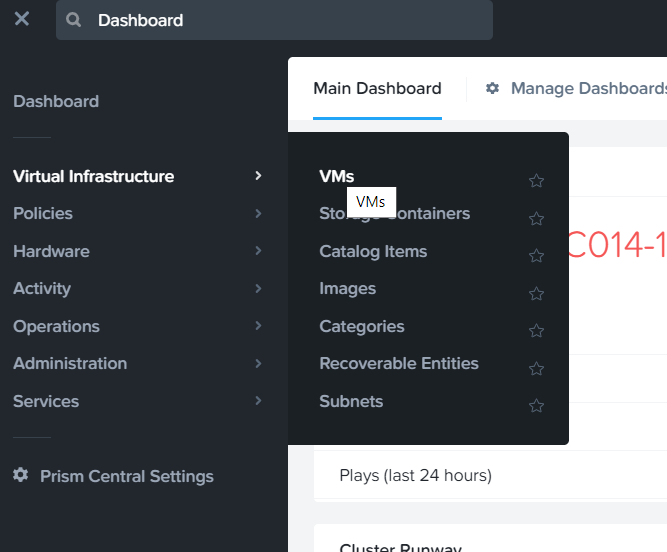
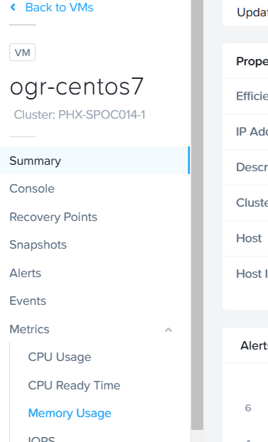
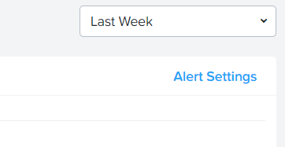
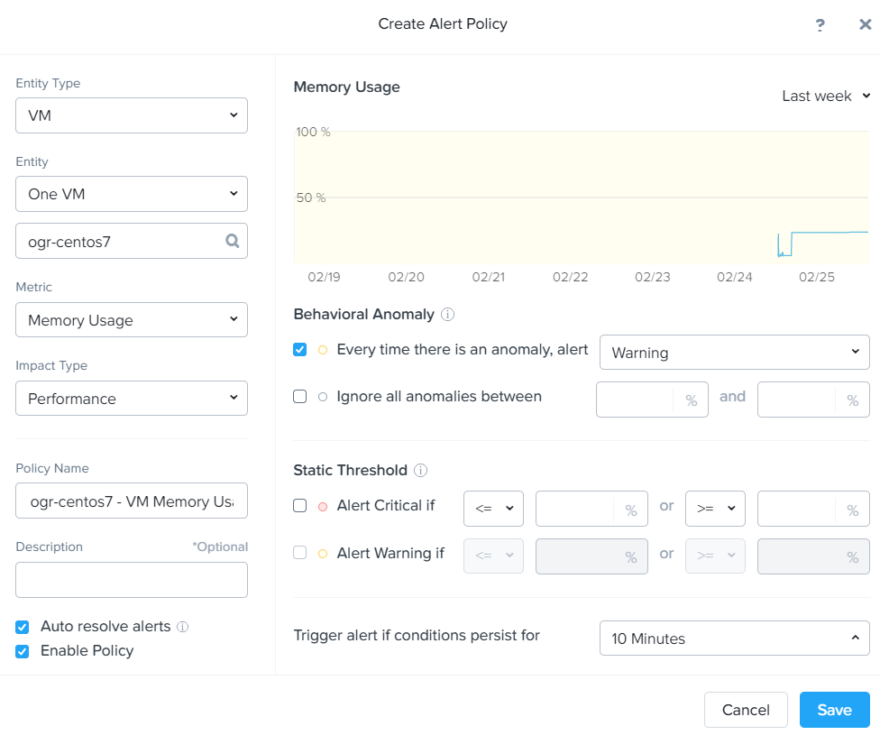
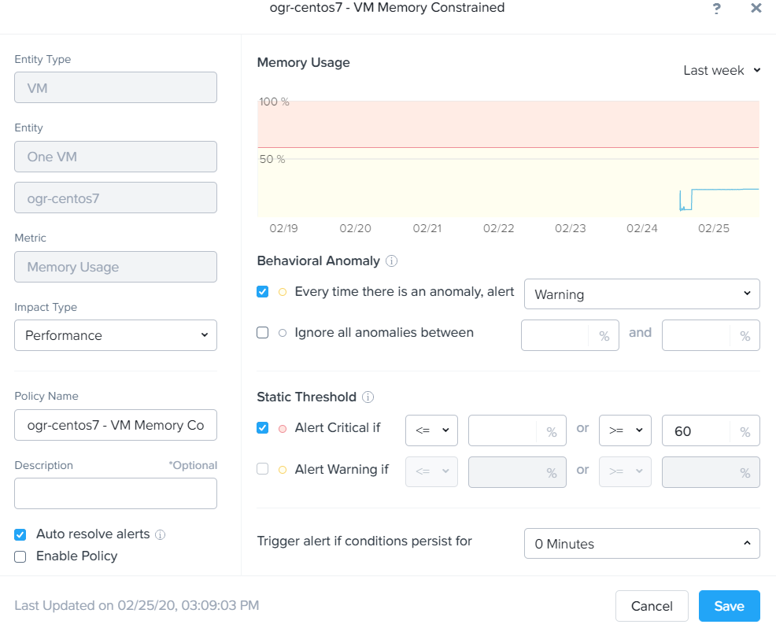
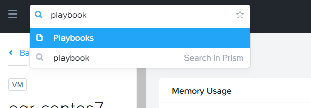
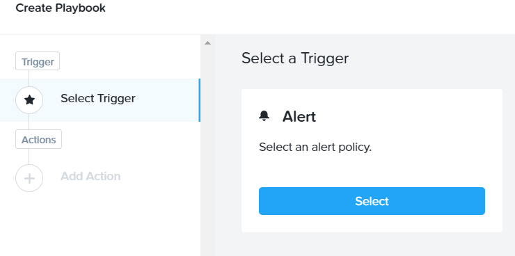
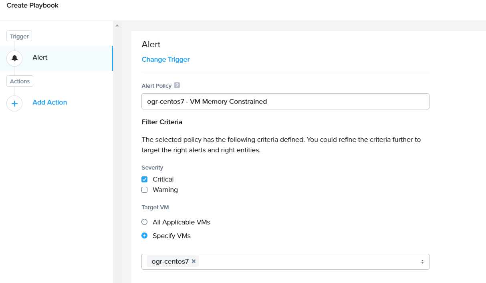
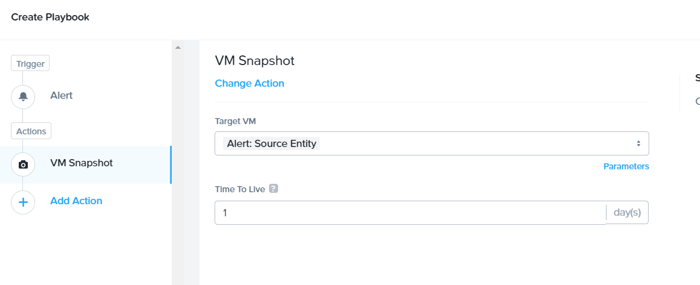
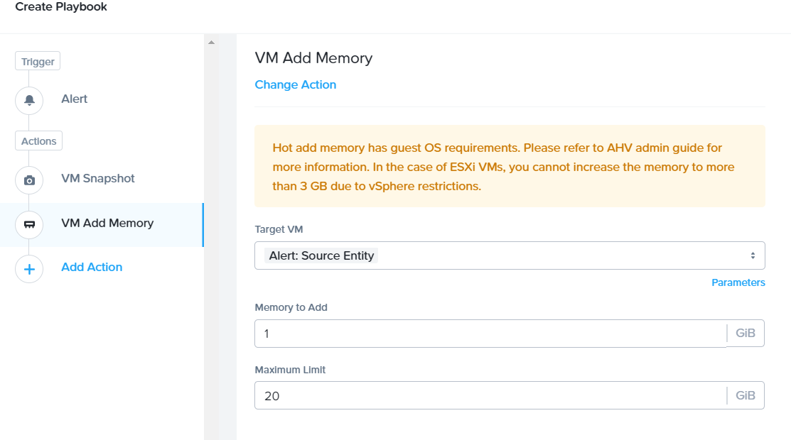
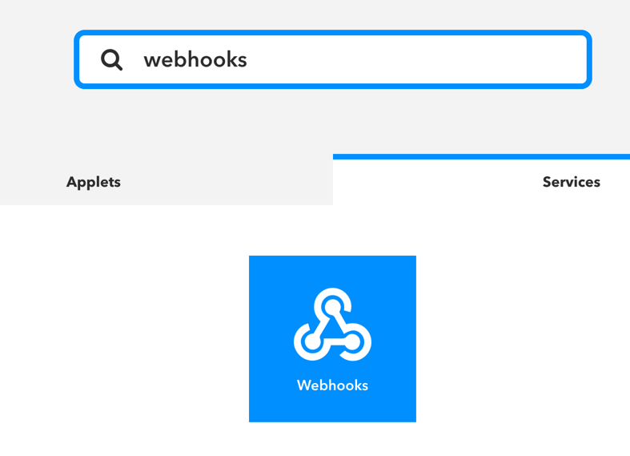
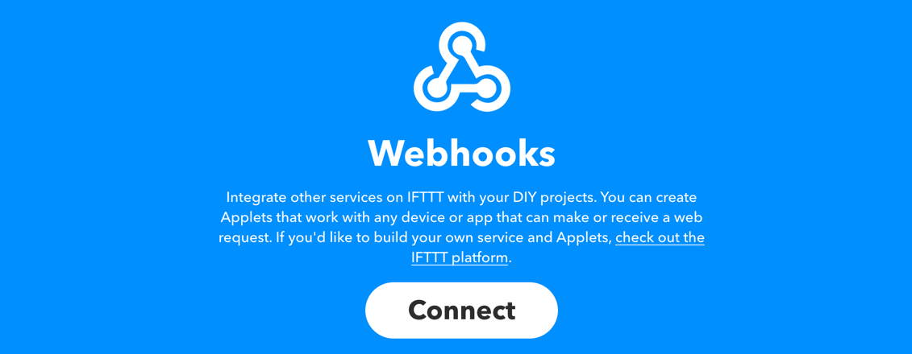
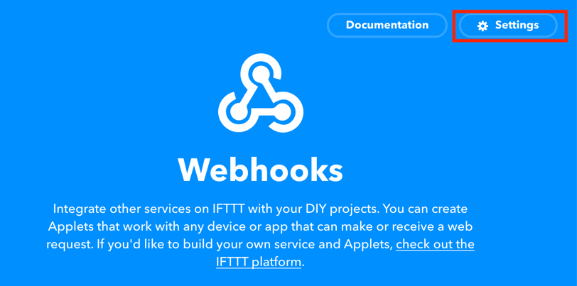
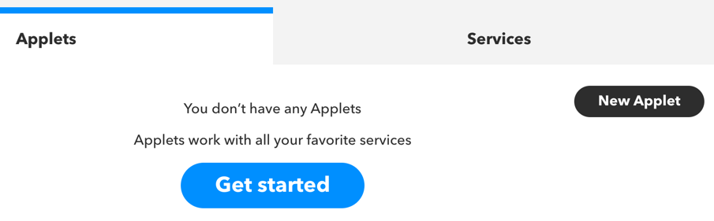
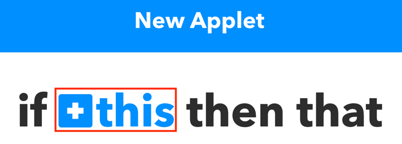
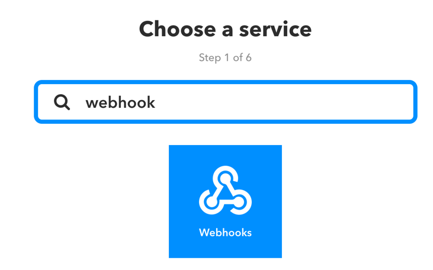
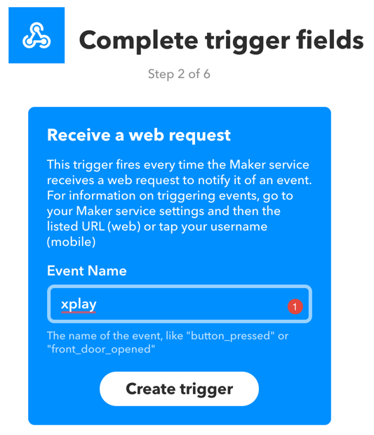
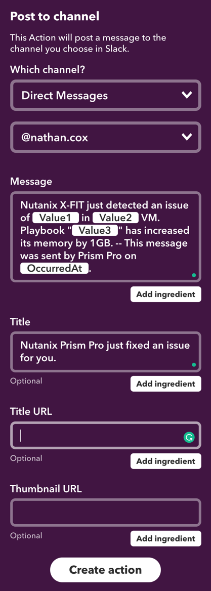
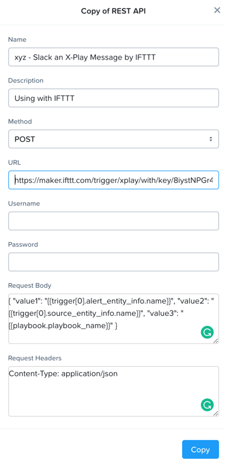
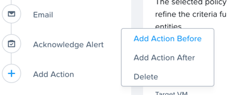
