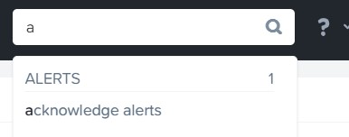
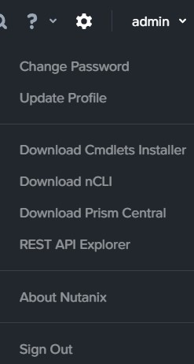
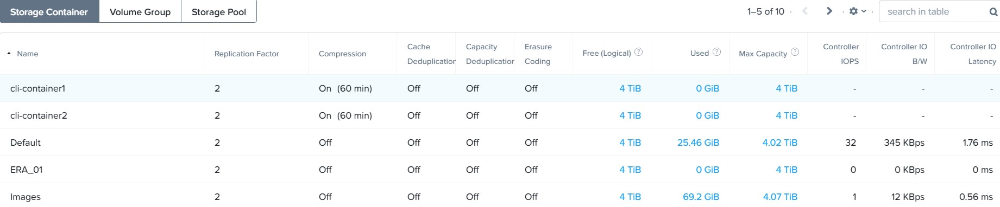

.. _managing_the_nutanix_cluster:

Lab 1
========

Exercise 1: Conducting Prism Element initial setup
--------------------------------------------------

    **Group Exercise**

    In this exercise, you will work as a group with your lab partner to log on to Prism for the first time and perform initial access tasks.

**1**. Open a browser on your Citrix VDI and enter the IP for your Cluster External IP Address shown in your lab handout. This is a floating IP that will run on one of your cluster CVMs. A Security page will be displayed, click Advanced, then click Proceed to <IP> (unsafe)

    |image001|

**You should now see the Prism Home page.**

Exercise 2: Configuring an NTP Server
-------------------------------------

**Group Exercise**

In this exercise you will work with your lab partner to configure an NTP time server for your
Nutanix cluster.

**1**. Click the gear icon in the upper right corner of the browser window, scroll down the Settings list displayed on the left side and select NTP Servers.

    |image002|

**2**. In the NTP Servers dialog box, add the NTP Server IP address located in the lab handout. Click + Add. If the NTP server IP is already present, verify it matches the specified IP.

    |image003|

.. note:: 

    *The IP address should appear in the HOSTNAME OR IP ADDRESS portion of the NTP Servers dialog box.*

**3**. Verify the NTP configuration using nCLI.

    a. Open the PuTTY utility on your virtual desktop.
    b. In the PuTTY Host Name (or IP address) field, type the IP address of the first CVM from your lab handout.
    c. In the PuTTY terminal window, login using the default CVM credentials. user: nutanix and password: *<password>*
    d. Once logged in, type the command:
        
>>>     $ ncli cluster get-ntp-servers

    e. Confirm the IP address you entered in Prism is shown. Type exit to close the PuTTY session.

Exercise 3: Using Nutanix Interfaces
------------------------------------

    **Group Exercise**

    In this exercise you will use the primary Nutanix interfaces: Prism Element and nCLI.

**1**. From the Prism UI, in the upper right corner, click the User drop down menu (it will be labeled with the currently logged-in user “admin”) and select About Nutanix.

    |image004|

Which version of Acropolis (AOS) are you running?
What is the license type on your cluster?

**2**. Click Close to close the dialog box.

**3**. At the upper-right, click the question mark (?). From the drop down menu, click Health Tutorial. This loads the Health Dashboard and starts a Welcome to Health Page dialog box, click Next. After the simulation loads, click Next through the tutorial to view the Health Dashboard features.

    |image005|

**4**. When completed, click OK, got it! to exit the simulation.

**5**. Click the dashboard drop down menu (currently labeled Health). This drop down menu will show of all the dashboards. Select the **VM** dashboard.

    |image006|

From the Overview page, locate the VM Summary at the middle left. How many virtual machines are shown?

**6**. In the upper-left corner of the browser window, click Table

    |image007|

Are any VMs listed? If so, what VMs are they? If not, why not?

**7**. At the upper-middle-right of the VM Dashboard page, click to select the Include Controller VMs check box and answer the following questions:

    |image008|

How many cores are allocated to each CVM?

How much memory is allocated to each CVM?

**8**. Click the gear icon, scroll through the Settings on the left, select SSL Certificate, write down the Type and Algogithm

======================================== =======================================
Key Type                                 `________________________`
Signing Algorithm                        `________________________`
======================================== =======================================

**9**. Click the magnifying glass found at the top right of the Prism window.

**10**. Type the letter a in the search bar and click acknowledge alerts. You are automatically redirected to the Alerts dashboard.

    |image009|

**11**. Moving the mouse cursor to any alert listed under the **Title** column reveals a hyperlink. Select any alert hyperlink. This switches you to the page dedicated to that alert. Click **Acknowledge** at the upper-right of the page. This logs that the alert has been seen. In the left column, the **Status** should show **Acknowledged**. Select the X at the upper-right (immediately to the right of Acknowledge) to close the page.

**12**. Select the same alert you selected in the previous step and click **Resolve**. The **Status** changes to **Resolved**. Alerts which have been resolved do not display by default on the Alerts dashboard. Click the **X** once again to exit the page. The alert should no longer be displayed in the list of Alerts.

Exercise 4: Exploring Prism Views
---------------------------------

    **Group Exercise**

    In this exercise you will explore various views in Prism.

**1**. Click the **dashboard** drop down menu and select each of the dashboards in turn. Note which dashboards have a **Table** view, an **Overview** view, and/or a **Diagram** view.

.. note::

    *The last dashboard selected will be represented on the top bar of the UI.*

    |image010|

**2**. Explore the features available under the **Settings** page (**gear** icon) and answer the followingquestions:
    
    What is current and maximum setting for **Session Timeout for Current User (UI Settings)**?
    
    What is the IP of the current name server (Name Servers)?

**3**. Click the cluster name at the top-left corner of the UI and review the **Cluster Details** window.

**4**. Explore the functions available under the **User** menu (it will be labeled with the currently logged-in user, **admin**). The several **Download** selections open new tabs in your browser and require internet access.

    |image011|

**5**. Now that you are familiar with the Prism management interface, return to the **Home** dashboard by clicking on the Nutanix logo (“**X**”) or by selecting **Home** from the **dashboard** menue.

    |image012|

Exercise 5: Using nCLI
----------------------

In this exercise you will learn the Nutanix Command Line Interface (nCLI):

    - Basic Commands and Getting Help
    - Extracting Information
    - Use nCLI to Build a Storage Container

Task 1: Accessing nCLI and Using Basic Commands
+++++++++++++++++++++++++++++++++++++++++++++++

    **Group Exercise**

    In this task you will work together to access the nCLI shell and perform basic commands.

**1**. In the PuTTY Host Name (or IP address) field, type the IP Address of the first CVM from your lab handout. Login as the user nutanix with the password listed in your lab handout.

**2**. From the command prompt, type ncli to enter the nCLI shell.

    |image013|

**3**. Type help or hit the tab key twice to view all possible commands from within the nCLI.

**4**. To display help for the datastore entity, type the command: 

>>>     <ncli> datastore help

**5**. To get help on the container entity, type the command:

>>>     <ncli> container help

What command do you enter to get nCLI help for user accounts?

What command do you enter to list user accounts?

Task 2: Extracting Information
++++++++++++++++++++++++++++++

    **Group Exercise**

    In this task you will work together to use the nCLI shell to answer the following questions.

**1**. Type **storagepool** list. How many storage pools does the cluster have?

>>>     <ncli> storagepool ls
    
**2**. Type the command that lists all the storage containers in the cluster. How many storage containers does the cluster have?
    
**3**. Refer to the storage container named **default** and answer the following questions:
        
        * How much free space is available in the storage container?
        * How much space has been used in the storage container?
        * What is the compression setting?

**4**. Find and use the command to list all virtual machines in the cluster. How many virtual machines are there in the cluster? Does this include or exclude CVMs?
    
**5**. Type **cluster info** to display cluster information. Answer the following questions:
        
        * What AOS software version is running on the cluster? (Compare the output from the cluster version command.)
        * How many nodes and blocks are in the cluster?
        * What is the cluster time zone?

**6**. Type **exit** to leave the **nCLI** shell and return to the **Bash** shell.

**7**. You can combine Bash shell commands and nCLI commands to filter and format nCLI output. For example, to count the number of SSDs in the cluster, type the command:

>>>     ncli disk list | grep SSD | wc -l

.. note::

    *The final character in the above command is the letter “l” (lowercase “L”).*

..

        * How many SSDs are in the cluster?
        * How many HDDs are in the cluster?

**8**. In the Prism UI, confirm your findings by switching to the **Hardware** dashboard, clicking the **Table** tab, then clicking the **Disk** button. Review the **Tier** column to confirm.

Task 3: Using nCLI to Build a Storage Container
+++++++++++++++++++++++++++++++++++++++++++++++

        **Group Exercise**

In this task you will create and delete a storage container using nCLI.

**1**. In your PuTTY connection to one of your CVMs, type ncli to enter the nCLI shell.

**2**. To get help with the container create command, type:

>>>     <ncli> container create help

**3**. The name of the storage pool is a required argument to the container create command. Get the unique name of the default storage pool by typing the following command:

>>>     <ncli> storagepool list

**4**. Create a container named **cli-container1** by typing the following command:

>>>     <ncli> container create name=cli-container1 sp-name=default-storage-pool-#####

        Where ##### is the cluster ID based on what you discovered in the previous step.

**5**. Repeat the previous step to create a second container named cli-container2 in the default storage pool

**6**. From the Prism UI, click the **Dashboard** menu and go to ***Storage > Table > Storage Container** to confirm both containers were created.

    |image014|

**7**. Click to select **cli-container1**.

    |image015|

**8**. Immediately below the table of containers and at the far right, click **Delete**. In the confirmation dialog box, click **Delete** to confirm the action.

    |image016|

9. Verify that **cli-container1** has been deleted while **cli-container2** remains.

**10**. Return to your SSH (PuTTY terminal) session.

**11**. Delete the second container you created:

>>>     <ncli> container remove name=cli-container2

**12**. Verify both containers have been deleted: 

>>>     <ncli> container list

.. |image014| image:: images/img014.jpg

.. |image016| image:: images/img016.jpg