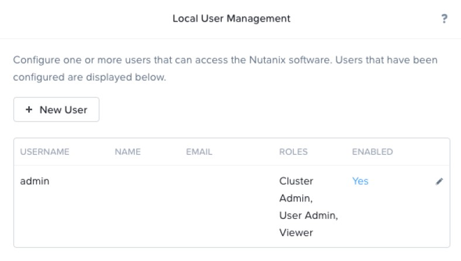
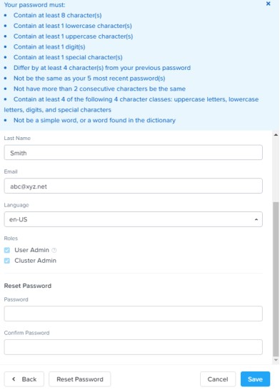
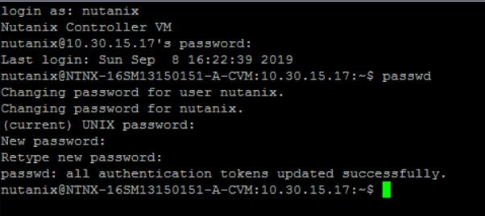

.. _lab2_securing_nutanix_cluster:

Lab 2
=====

Exercise 1: Adding a User
-------------------------

    **Individual Exercise**

    In this exercise you will work individually to add a local (i.e. non-domain) user account to your Nutanix cluster. This user will have permission to log on and perform cluster tasks based on the level of access granted to them.

**1**. Log on to your cluster’s Prism UI if needed.

**2**. Click the **gear** icon and scroll down the **Settings** column and select **Local User Management**.

**3**. In the **Local User Management** window, click **+ New User**.

  |image018|

**4**. Use the table below to complete the fields in the Create User window:

========== ===================================================================
Field      **Value**
USERNAME   **Your initials**
FIRST NAME **Your first name**
LAST NAME  **Your last name**
EMAIL      **abc@xyz.net**
PASSWORD   **Use your full name with first letter capitalized and add /4u, eg: Johnsmith/4u**
LANGUAGE   **Your preferred language (e.g. en-US)**
ROLES      **Cluster Admin (You may need to scroll down)**
========== ===================================================================

**5**. Click Save.

Exercise 2: Verifying the New User Account
------------------------------------------

**1**. Log out of the Prism interface by clicking the Username menu (next to the gear icon and is currently admin) and select Sign Out.

**2**. Log on to the Prism interface with the user account that you created in the previous exercise.

**3**. Observe your user account name (instead of admin) in the upper-right corner.

**4**. Click the gear icon, scroll down the Settings page and observe whether you can see and select Local User Management.

    Are you able to administer new user accounts?

.. note::

    *You should not be able to perform that action because the assigned **Cluster Admin** role does not have rights to administer user accounts.*

..

**5**. Log out of Prism by clicking the **Username** menu and select **Sign Out**.

Exercise 3: Updating Default Passwords
--------------------------------------
.. note::

    Perform this exercise on the last day of class to in case you are unable to retrieve your updated password.

..

Task 1: Changing the Admin User Password
++++++++++++++++++++++++++++++++++++++++

**1**. Work together with your lab partner to log on to Prism with the admin user account and password (See lab handout).

**2**. Change the admin user password for Prism by clicking the gear icon to access the Settings page. Scroll down and select Local User Management.

**3**. Click the pencil icon to the right of the admin user to access the Update User dialog box.

**4**. Fill out the attributes for the admin user using the information in the table below.

.. list-table::
 :widths: 25 75
 :header-rows: 1

 * - Field
   - **Value**
 * - USERNAME
   - **Your first name**
 * - FIRST NAME
   - **Your first name**
 * - LAST NAME 
   - **Your last name**
 * - EMAIL 
   - **abc@xyz.net**
 * - LANGUAGE 
   - **Your preferred language (e.g. en-US)**
 * - ROLES 
   - **User Admin, Cluster Admin**

**5**. Select Reset Password. A list of password parameters will be displayed. Scroll down to see the new change password fields.

  |image019|

**6**. Enter the password: (See lab handout) in both fields and click Save.

**7**. Log out of Prism by clicking the Username menu (next to the gear icon) and select Sign Out.

**8**. Log back into Prism with the admin user and the new password.

.. note::
    
    Changing the password for the current user can also be done from the Username menu next to the gear icon. Click the username and select Change Password.

..

Task 2: Changing the CVM Nutanix User Passwords
+++++++++++++++++++++++++++++++++++++++++++++++

    **Group Exercise**

  For this task, you will work with your lab partner to change the password for the nutanix user.

**1**. Using PuTTY, start an SSH connection to one of the CVMs in your cluster. Log on as the **nutanix** user and the default password **<cluster password>**. The following steps can be done on any CVM currently participating in the cluster. After a successful password change, the new password will be synchronized across all CVMs in the cluster.

**2**. From the command line interface, use the  passwd  command to change the password for the nutanix user. See the lab handout for the new password.

  |image020|

**3**. Type **exit** to end the PuTTY session.

.. note::

  *If you change the password of the admin user from the default, you must specify the password every time you start an nCLI session from a remote system. A password is not required if you are starting an nCLI session from a Controller VM where you are already logged on.*

