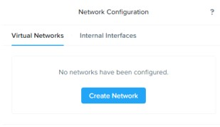
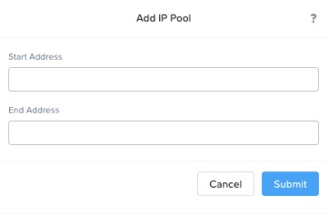
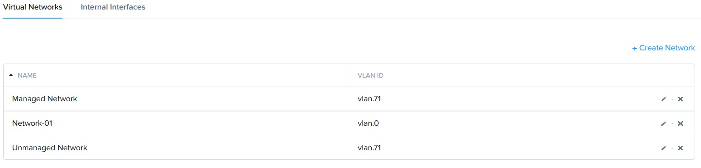

.. _lab3_networking:

Lab 3
========

Exercise 1: Creating an Unmanaged Network
-----------------------------------------

        **Group Exercise**

    In this exercise you will work with your lab partner to create an unmanaged network.

**1**. Log on to your cluster’s Prism UI as the admin user.

**2**. Click the gear icon, scroll down in Settings to the Network section and click Network Configuration.

    |image024|

**3**. Click Virtual Networks if not already selected. There should be already two networks configured **Network-01** and **Network-02**

  |image021|

**4**. Click Create Network.

**5**. Fill out the Create Network dialog box as follows:

============================= =============================
Name                          **Unmanaged Network**
LAN ID                        **Refer to your lab handout**
Enable IP address management  **Leave unchecked**
============================= =============================

**6**. Click Save to create the network.

**7**. Verify you now have an **Unmanaged Network** and a **Network-01, Network-02** in the Network **Configuration** dialog box.

  |image023|

Exercise 2: Managing Open vSwitch (OVS)
---------------------------------------

    **Group Exercise**

 In this exercise you will work with your lab partner to explore a few commands to manage Open vSwitch (OVS) from the CVM and use those commands to build an additional virtual switch.

**1**. Using PuTTY, establish an SSH connection to one of your CVMs and log on with the **nutanix** user and password **(See lab handout)**.

**2**. Use **allssh** to execute commands on all CVMs. To view network interface information, type the command:

 .. code-block:: bash

     allssh manage_ovs show_interfaces
    
    * How many network interfaces are on each node?
    * How many network interfaces are 10GbE?
    * How many network interfaces are 1GbE?

**3**. To list existing bridges for each Nutanix node in the cluster, type the command:

 .. code-block:: bash

    allssh manage_ovs show_bridges
    
    * How many bridges are on each node?

**4**. To show bridge uplinks for each Nutanix node in the cluster, type the command:

 .. code-block:: bash

     allssh manage_ovs show_uplinks
   
   * Which network interfaces are on bond (or port) **br0-up** of the first bridge (**br0**)?

Exercise 3: Creating a New OVS
------------------------------

    **Group Exercise**

 In this exercise you will work with your lab partner to create a new virtual switch.

**1**. Create a new virtual switch by typing the following command from any CVM:

 .. code-block:: bash

     hostssh ovs-vsctl add-br br1
     allssh manage_ovs show_bridges

**2**. Remove the 1GbE interfaces from the default bridge by typing the following command on any CVM:

 .. code-block:: bash

     allssh manage_ovs --bridge_name br0 --interfaces 10G update_uplinks

**3**. Now associate the 1GbE interfaces with the new br1 by typing the following command on any CVM:

 .. code-block:: bash

     allssh manage_ovs --bridge_name br1 --bond_name bond1 --interfaces 1G update_uplinks

**4**. Verify the changes have been successfully written by typing the following command on any CVM:

 .. code-block:: bash

     allssh manage_ovs show_uplinks

.. note::

    Separating the different speed interfaces to separate bridges, gives better overall performance. Adding the interfaces to a new bridge requires a new bond specification, otherwise the system will add the interfaces to the new bond in br1 and also try to add them to the bond in br0. This will cause a failure since bond0 is not part of br1. 
    
..

**5**. Type  exit  to close the PuTTY session. 

