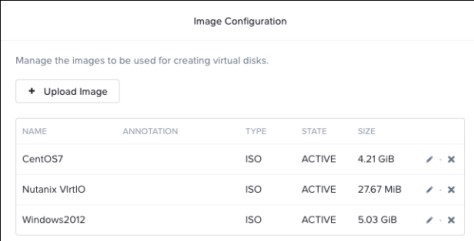
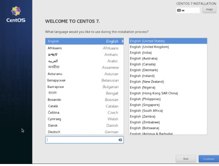

.. _lab4_vm_managment:

Lab 4
========

Exercise 1: Uploading an Image
------------------------------

        **Group Exercise**

    In this exercise you will upload ISO images for Windows Server 2012 R2, CentOS7 and Nutanix VirtIO.

**1**. Log on to your cluster’s Prism UI as the **admin** user.

**2**. Switch to the **Storage** dashboard.

**3**. In the upper right corner of the UI, click **+ Storage Container**.

**4**. Use the following table to complete the fields in the **Create Storage Container** window:

.. list-table::
 :widths: 25 75
 :header-rows: 0

 * - Name
   - **ISOs**
 * - Storage Pool  
   - **Use default storage pool**
 * - Advanced Settings 
   - **Do not configure Advanced Settings**

**5**. Click **Save**.

**6**. Click the **gear** icon and in the **Settings** column on the left, locate and click **Image Configuration**.

**7**. Upload the **Windows 2012 R2 ISO** to the Image Configuration: 
  
  **a**. Click **+ Upload Image**.

  |image024|

..

  **b**. Fill in the **Create Image** dialog box fields as follows:

.. list-table::
 :widths: 25 75
 :header-rows: 0

 * - Name
   - **Windows-2012-R2-ISO**
 * - Image Type   
   - **ISO**
 * - Storage Container  
   - **ISOs**

..

  **c**. In the **Create Image** dialog box, under **Image Source**, click **Upload a file.**

  **d**. Click **Choose File** and navigate to the location of the **Windows 2012 R2 ISO** file and select it. The file name and location are listed in your lab handout.
  
  **e**. Click **Open**.

  **f**. Click **Save**.

**8**. Upload the **CentOS ISO** to the Image Configuration:

  **a**. Click **+ Upload Image**.

  **b**. Fill in the **Create Image** dialog box fields as follows:

.. list-table::
 :widths: 25 75
 :header-rows: 0

 * - Name
   - **CentOS7-ISO**
 * - Image Type   
   - **ISO**
 * - Storage Container  
   - **ISOs**

..

**c**. In the **Create Image** dialog box, under **Image Source**, click **Upload a file**.

**d**. Click **Choose File** and navigate to the location of the **CentOS ISO** file and select it. The file name and location are listed in your lab handout.

**e**. Click **Open**.

**f**. Click **Save**.

**9**. Upload the Nutanix VirtIO ISO to the Image Configuration:

  **a**. Click **+ Upload Image**.

  **b**. Fill in the **Create Image** dialog box fields as follows:

.. list-table::
 :widths: 25 75
 :header-rows: 0

 * - Name
   - **Nutanix-VirtIO-ISO**
 * - Image Type   
   - **ISO**
 * - Storage Container  
   - **ISOs**

..

  **c**. In the **Create Image** dialog box, under **Image Source**, click **Upload a file**.

  **d**. Click **Choose File** and navigate to the location of the **Nutanix VirtIO ISO** file and select it. The file name and location are listed in your lab handout.

  **e**. Click **Open**.

  **f**. Click **Save**.

**10**. When all images have been uploaded into the Image Service, the Image Configuration window should show all three images. It is important that, before continuing, you ensure all images are shown with an Active state. If any images are shown as Inactive, wait until they are shown as Active. Refresh your browser.

  |image025|

Exercise 2: Creating a Windows Virtual Machine
----------------------------------------------

    **Individual Exercise**

  In this exercise you will work individually to create a Windows virtual machine and connect it to the unmanaged network. This exercise is composed of the following tasks:

    * Build a Windows Virtual Machine

    * Install a Windows Operating System
    
    * Attach and install Nutanix Guest Tools

..

Task 1: Building a Windows Virtual Machine
++++++++++++++++++++++++++++++++++++++++++

..

**1**. Working individually, in the Prism UI, change to the **VM** dashboard.

**2**. In the upper-right corner of the UI window, click **+ Create VM**.

  |image026|

..

**3**. Complete the Create VM dialog box with the information contained in the following table:

.. list-table::
 :widths: 25 75
 :header-rows: 0

 * - Name
   - **Windows-<your initials>** Use the initials of your full name. For example: Windows-ABC
 * - Description   
   - Leave blank.
 * - Use this VM as an agent VM  
   - Do not select.
 * - VCPU(s)   
   - **1**
 * - Number of Cores per VCPU  
   - **2**
 * - Memory  
   - **4**

..

4. Scroll down in the **Create VM** dialog box to the **Disks** section. Click the **pencil** (edit) icon to the right of **CD-ROM**.

  |image027|

..

5. Attach the **Windows 2012 R2 ISO** from the Image Service to the VM by completing the **Update Disk** dialog box with the information contained in the following table:

.. list-table::
 :widths: 25 75
 :header-rows: 0

 * - Type
   - **CD-ROM (greyed out)**
 * - OPERATION   
   - **Clone from Image Service**
 * - BUS TYPE   
   - **Leave at default (IDE)**.
 * - IMAGE   
   - **Select the Windows 2012 R2 ISO image**

..

**6**. Click **Update**.

**7**. Scroll down in the **Create VM** dialog box to the **Disks** section. Click **+ Add New Disk**.

**8**. Attach the **Nutanix VirtIO ISO** from the Image Service to the VM by completing the **Update Disk** dialog box with the information contained in the following table:

.. list-table::
 :widths: 25 75
 :header-rows: 0

 * - Type
   - **CD-ROM (greyed out)**
 * - OPERATION   
   - **Clone from Image Service**
 * - BUS TYPE   
   - **Leave at default (IDE)**.
 * - IMAGE   
   - **Select the Nutanix VirtIO image**

..

**9**. Click **Add**.

**10**. Scroll down in the **Create VM** dialog box to the Disks section. Click **+ Add New Disk**.

**11**. Add a **40GB** virtual disk to the VM by completing the **Update Disk** dialog box with the information contained in the following table:

.. list-table::
 :widths: 25 75
 :header-rows: 0

 * - Type
   - **DISK**
 * - OPERATION   
   - **Allocate on Storage Container**
 * - BUS TYPE   
   - **Leave at default (SCSI)**.
 * - Storage Container    
   - **default-container-#####**
 * - Size (GiB)    
   - **40**.
 * - Index    
   - **Leave at the default value**

..

**12**. Click **Add**.

**13**. Scroll down in the **Create VM** dialog box to the Network Adapters (NIC) section. Click **+ Add New NIC**.

**14**. In the **Create NIC** dialog box, under **VLAN Name**, select the **Unmanaged Network**. Leave all other fields at their default value. Click **Add**.

**15**. Click **Save**.

**16**. In the upper-left corner of the UI, select **Table** to view your list of VMs.

.. note::

  The VM just created will be in a powered off state.

..

Task 2: Installing the Windows Operating System
+++++++++++++++++++++++++++++++++++++++++++++++
..

    **Individual Exercise**

  In this exercise, you will work individually to power on your new virtual machine and install the **Windows Server 2012 R2** operating system. These steps require a console connection to the VM. To get the maximum ability to resize the console, use **Internet Explorer** as the Prism browser. If you would rather use Chrome or Firefox, you will need to disable the pop-up blocker. All console exercises can be done with any browser.

 **Chrome**

    * Click the vertical ellipsis (…) at the upper right of the **Chrome** browser window.
    * Click **Settings**, and then **Advanced** at the bottom of the page.
    * Under **Privacy and Security**, click **Content Settings**.
    * Click popups and then click the **slider** button to the right of **Blocked (recommended)**.
    * Close the tab.

..

 **Firefox**

    * Click the menu symbol (three horizontal lines) at the upper right of the browser window.
    * Click Options, then Privacy & Security.
    * Scroll down to the Permissions section and de-select the Block pop-up windows box.
    * Close the tab.

**1**. From the **VM** dashboard, select **Table** view.

**2**. Click to select the virtual machine you created in the previous task. The options line for this **VM** displays immediately below the VM table.

  |image028|

3. In the list of options available for your VM, click **Power On**.

  |image029|

4. After the machine is powered-on, the **Launch Console** link will become active. Click **Launch Console**.

.. note::

  If the VM Console window does not appear, your browser may be blocking popups.

.. note::

  If you receive a **boot image** error and the 2048 game is displayed, check the CD-ROM images you have set for the VM and verify the **Windows 2012 R2 installer** image is in the first CD-ROM.

..

**5**. In the console of your **Windows** virtual machine, take the defaults (language, time, keyboard) in the **Windows Setup** dialog box by selecting **Next**.

**6**. Click **Install now**.

**7**. Click to select **Windows Server 2012 R2 Standard (Server with a GUI)** and click **Next**.

  |image030|

**8.** Accept the license terms and click **Next**.

**9**. Click **Custom: Install Windows only (advanced)**.

**10**. To display the **Windows VM** virtual disk, you must install the **Nutanix VirtIO** drivers. Click **Load driver**.

  |image031|

**11**. In the **Load driver** dialog box, click **Browse**.

**12**. Expand the CD-ROM with the **Nutanix VirtIO ISO** attached and click to expand the **Windows Server 2012 R2** folder, then click to select **amd64**. Click **OK**.

  |image032|

**13**. Select all the available drivers and click **Next**. The **VirtIO** drivers will take a minute or two to install. Wait for the install to finish before continuing with the next step.

  |image033|

**14**. Select the now visible 40GB **Drive 0** and click **Next**.

  |image034|

**15**. When prompted for an Administrator password, type: **(See lab handout)** and click **Finish**.

**16**. To log on, click the **Control-Alt-Delete** icon in the upper-righthand corner of the console window (the icon looks like a stack of three blocks). Log on as **Administrator** using the password you set up in the previous step.

  |image035|

**17**. Disable the Server Manager from auto starting. In the **Server Manager** window, click **Manage** at the upper right and select **Server Manager Properties**. In the new dialog box, click the check box for **Do not start Server Manager automatically at logon**. Click **OK** and close the Server Manager. 

**18**. Power off Windows by selecting the four pane **Windows** icon at the lower left, on the **Windows** task bar. Click the **power** icon at the upper-right and choose **Shut down**. Choose **Other (Planned)** from the drop down menu and click **Continue**.

**19**. Close the console window.

**20**. Click to select your **Windows VM** in the VM table and click the **Update** link below the **VM** table.

**21**. Scroll down in the **Update VM** window and click the X to the right of the second CD-ROM drive. This will delete the now unnecessary second CD-ROM drive from the VM. Click **Yes** when you are asked to confirm the CD-ROM deletion.

  |image036|

**22**. Scroll down in the **Update VM** window and click the **eject** button to the immediate left of
the **pencil** icon for the remaining **CD-ROM**.

  |image037|

**23**. The remaining CD-ROM should now show **EMPTY=true**. Click **Save** to exit the **Update VM** window.

..

Task 3: Enabling Nutanix Guest Tools on Windows
+++++++++++++++++++++++++++++++++++++++++++++++
..

  **Individual Exercise**

  In this task you will install Nutanix Guest Tools (NGT) into your Windows virtual machine.

**1**. Click to select your **Windows-<your initials>** virtual machine.

**2**. Click **Manage Guest Tools** from the links below the table of VMs.

**3**. In the **Manage VM Guest Tools** window, click the **Enable Nutanix Guest Tools** check box.

**4**. Click both the **Mount Nutanix Guest Tools** and **self Service Restore (SSR)** check boxes and click **Submit**.

  |image038|

**5**. Click **Power on** from the links below the table of VMs.

**6**. Once the virtual machine has powered on, click **Launch Console**.

**7**. Click the **Ctl-Alt-Del** icon (stacked blocks) at the upper right corner of the **VM Console** window.

**8**. Log on to the Windows virtual machine as Administrator. See the lab handout for the password.

**9**. Open **Windows File Explorer (File Manager)**.

  |image039|

**10**. Double-click the **NUTANIX_TOOLS** CD drive.

**11**. Double-click **setup** to begin the installation process.

**12**. In the **Nutanix Guest Tools Setup** window, click the check box to agree to the license terms and then click **Install**. The installation of Nutanix Guest Tools will take a minute or two to complete.

**13**. When the installation has completed, click **Close**. Close the **VM console** window.

Exercise 3: Creating a Linux Virtual Machine
--------------------------------------------

    **Individual Exercise**
  
  In this exercise you will work individually to create a CentOS VM.

**1**. From the VM Dashboard, click the **+ Create VM button**.

**2**. Complete the **Create VM** dialog box with the information contained in the following table:

.. list-table::
 :widths: 25 75
 :header-rows: 0

 * - NAME
   - **CentOS7-<your initials>, use the initials of your full name. For example: CentOS7-ABC**
 * - DESCRIPTION   
   - **Leave blank.**
 * - Use this VM as an agent VM   
   - **Do not select.**.
 * - VCPU(S)     
   - **2**
 * - NUMBER OF CORES PER VCPU    
   - **2**.
 * - MEMORY    
   - **8**

**3**. Scroll down in the **Create VM** dialog box to the **Disks** section and click the CD-ROM’s **pencil** icon.

4. Complete the **Update Disk** dialog box with the information contained in the following table:

.. list-table::
 :widths: 25 75
 :header-rows: 0

 * - Type
   - **CD-ROM (greyed out)**
 * - OPERATION    
   - **Clone from Image Service**
 * - BUS TYPE   
   - **Leave at default (IDE)**.
 * - IMAGE     
   - **Select the CentOS7 ISO image**

**5**. Click **Update**.

**6**. Scroll down in the **Create VM** dialog box to the **Disks** section and click **+ Add New Disk**.

**7**. Complete the **Add Disk** dialog box with the information contained in the following table:

.. list-table::
 :widths: 25 75
 :header-rows: 0

 * - Type
   - **DISK**
 * - OPERATION   
   - **Allocate on Storage Container**
 * - BUS TYPE   
   - **Leave at default (SCSI)**.
 * - Storage Container     
   - **default-container-#####**
 * - Size    
   - **40**.
 * - Index    
   - **Leave at default value**

**8**. Click **Add**.

**9**. Scroll down in the **Create VM** dialog box to the **Network Adapters (NIC)** section and click **+ Add New NIC**.

**10**. In the **VLAN Name** drop-down menu, select **Managed Network** and click **Add**.

**11**. Click **Save**.

**12**. Click to select your **CentOS7-<your initials>** VM and click **Power on**.

**13**. Click **Launch Console**.

**14**. Select **Install CentOS 7** (or wait for auto-boot). Once the booting starts you will be able to resize the window. Resize the window to suit your needs.

  |image040|

**15**. Select your preferred language (or take the default) and click the **Continue** button.

  |image041|

**16**. Click **INSTALLATION DESTINATION**.

  |image042|

**17**. Select the **NUTANIX VDISK** and then click the **Done** button in the upper-left corner of the window.

  |image043|

**18**. Click the **Begin Installation** button.

  |image044|

19. When the **User Settings** window is displayed, click **ROOT PASSWORD** to configure the password for the root user. The installation will still be in progress.

  |image045|

**20**. **See the lab handout** for the root password and click **Done** in the upper-left corner of the window.

**21**. Click **USER CREATION**. Create a user named student and set the password to **(See lab handout)**.

**22**. Click the box next to **Make this user administrator** and click **Done**.

**23**. After the **CentOS** initial installation has completed, click **Finish Configuration**, then click **Reboot**.

**24**. After the virtual machine reboots, log on as the user root using the password you created in the previous step.

  |image046|

**25**. Display the **VM NIC IP** address by entering the command:

>>>     ip addr sh

  |image047|

.. note::

    The output shows that the CentOS7 virtual machine has not received an IP address from the DHCP address pool. This is an expected outcome because the network adapter is disabled by default with CentOS.

..

**26**. Confirm the **eth0** interface is disconnected by entering the command:

>>>     nmcli d

  |image048|

**27**. Launch the **NetworkManager TUI** tool by entering the command:

>>>     nmtui

**28**. In the **NetworkManager TUI** window, using the **up/down** arrows on your keyboard, select **Edit a connection** and press the **Enter** key.

  |image049|

**29**. Use the **Tab** key to select **<Edit…>** and Press the **Enter** key. This will put you in the **Edit Connection** view.

  |image050|

**30**. In the **Edit Connection** view press the **Tab** key to navigate to **Automatically connect** and use the **spacebar** to then select **Automatically Connect**.

  |image051|

**31**. Press the **Tab** key to select **<OK>** and press the **Enter** key.

.. note::

    This will take you back one view.

..

**32**. Press the **Tab** key to select **<Back>** and press the **Enter** key.

**33**. Use the **up/down** arrow keys to select **Quit** and press the **Enter** key. This returns you to the command line.

**34**. Restart the network services by entering the command:

>>>     service network restart

**35**. Verify the virtual machine has been assigned an IP address by entering the command:

>>>     ip addr sh

  |image052|

**36**. Verify connectivity to the default gateway by entering the following command:

>>>     ping <get the gateway IP from your lab handout>

.. note::

    You will need to get the gateway IP address from your lab handout, do not necessarily use the IP address shown in the screenshot below.

  |image053|

.. note::

    Enter control-c to abort the ping command.

..

**37**. Shutdown CentOS by typing the following:

>>>    init 0

**38**. Close the **VM console** window.

..

  **Task 1: Enabling Nutanix Guest Tools on Linux**
  

    **Individual Exercise**

 In this task you will install Nutanix Guest Tools (NGT) into your CentOS7 virtual machine.

**1**. From the **VM** dashboard, select your **CentOS7-<initials>** virtual machine and click **Manage Guest Tools**.

**2**. In the popup dialog box, select **Enable Nutanix Guest Tools**. Select **Mount Nutanix Guest Tools** and **Self Service Restore (SSR)** check boxes. VSS should already be selected. Click **Submit**.

**3**. Click **Power on** for your CentOS/Linux VM and then click **Launch Console**.

**4**. Log on with the user: **root** and the password: **(See lab handout)**.

**5**. Perform the following steps to install Nutanix Guest Tools.

>>>     df -h (view what is currently mounted)
>>>     mount /dev/sr0 /mnt
>>>     df -h (/dev/sr0 shows mounted to /mnt)
>>>     cd /mnt/installer/linux
>>>     ./install_ngt.py

**6**. When the installation has completed, type **exit** and close the console window.

Exercise 4: Using Dynamic VM Resource Management
------------------------------------------------

      **Individual Exercise**

  In this exercise you will move your Windows VM from the unmanaged network to the managed network. You will also increase the amount of CPU and memory.

  This exercise is composed of the following tasks:
  
    * Reviewing Your Windows VM on the Unmanaged Network
    * Moving Your Windows VM to the Managed Network
    * Increasing CPU and Memory

Task 1: Reviewing Your Windows VM on the Unmanaged Network
++++++++++++++++++++++++++++++++++++++++++++++++++++++++++
    **Individual Exercise**

  In this task you will observe the behavior of a virtual machine attached to an unmanaged network.

**1**. From the **VM** Dashboard, select your **Windows-<your initials>** virtual machine from the table of virtual machines.

**2**. Ensure the VM is powered on and click **Launch Console**.

**3**. Click the Ctrl-Alt-Del icon and log on to the new Windows virtual machine if needed. Log on as Administrator with password (See lab handout).

**4**. On the task bar at the lower right, right-click the network icon (may have a yellow caution sign on top) in the system tray and click Open Network and Sharing Center.

  |image054|

**5**.. Click Ethernet.

  |image055|

**6**. In the dialog box, click **Properties**.

**7**. In the **Properties** dialog box, click to select **Internet Protocol Version 4 (TCP/IPv4)** and click **Properties**.

  |image056|

**8**. Verify that the **Obtain an IP address automatically** radio button is selected.

  |image057|

**9**. Close all Network and Sharing Center dialog boxes.

**10**. Open a command prompt on the Windows virtual machine by clicking the four pane **Windows Start** button on the task bar (in the lower left corner). Click the **magnifying glass** at the upper right and in the **search** field type:

>>>       cmd

**11**. Select **Command Prompt** from the list presented.

**12**. In the **command prompt** window enter the command:

>>>       pconfig

  What is the **IPv4** address assigned to the Ethernet adapter?

  What does this tell you about the state of DHCP services available to the Windows virtual machines?

**13**. Leave the **VM Console** window open for use in the next task.

Task 2: Moving your Windows VM to a Managed Network
+++++++++++++++++++++++++++++++++++++++++++++++++++

      **Individual Exercise**
    
  In this task, you will add and remove virtual NICs attached to the managed and unmanaged networks.

**1**. From the Prism VM dashboard, click to select the **Windows-<your initials>** VM and in the links below the **VM** table, click **Update**.

**2**. In the **Update VM** dialog box, scroll down to the **Network Adapters (NIC)** area and click **+ Add New NIC**.

**3**. In the **Create NIC** dialog box, select **Managed Network** from the **VLAN** Name drop-down menu and click **Add**.

**4**. Click **Save**.

**5**. Hover the mouse over the **IP Addresses** cell for the **Windows-<your initials>** VM.

  |image058|

  What IP address(es) are assigned to the virtual machine? 

**6**. In the remote console for the **Windows-<your initials>** VM, in the **Command Prompt** window enter the command:

>>>     ipconfig

  How many interfaces are displayed and what are the IPv4 addresses? 

**7**. In the **Prism VM**dashboard, click to select the **Windows-<your initials>** VM and click the **Update** link.

**8**. In the **Update VM** dialog box, scroll down to the **Network Adapters (NIC)** area and delete the virtual NIC for the **Unmanaged Network** by clicking the **X** adjacent to it. 

    a.	Click Yes to confirm the NIC deletion. 
    b.	Click Save.

**9**. Hover the mouse over the IP Addresses cell for the VM.

  What IP address(es) are now shown? 

**10**. In the console for the **Windows-<your initials>** VM, in the **Command Prompt** window enter the command:

>>>     ipconfig

  How many network interfaces are displayed? 
  
  What IP address(es) are now configured in this VM? 

**11**. Close the **VM Console** window. 

Task 3: Updating CPU and Memory
+++++++++++++++++++++++++++++++

      **Individual Exercise**

  In this task, you will add a CPU and increase the amount of Memory on your Windows VM.

**1**. From the Prism **VM** dashboard, click to select the **Windows-<your initials>** VM and in the links below the **VM** table, click **Update**.

**2**. In the **Update VM** dialog box, under **Compute Details**, increase the VCPU(S) from **1** to **2** and the Memory from **4** to **8**.

**3**. Click **Save**.

**4**. This should result in an update error. Dynamic bulk updates to a VM are not allowed.

  |image059|

.. |image029| image:: images/img029.jpg

