.. _lab5_healt_mintoring_and_alerts:

Lab 5
========

Exercise 1: Creating a Performance Chart
----------------------------------------

   **Individual Exercise**

   In this exercise you will create a performance chart to monitor VM disk I/O.

**1**. If you are not logged into your Prism UI, log on now as the **admin** user.

**2**. From the **dashboard** drop down menu, click **Analysis**.

**3**. In the upper left of the UI, click **New** and then click **New Entity Chart**. An entity can be a host, a VM, a container and so on.

..

   |image060|

**4**. Fill in the **New Entity Chart** fields as detailed in the following

   table:

=========== =================================
Chart Title VM Disk Write I/O-<your initials>
=========== =================================
Entity Type Virtual Machine
Entity      CentOS7-<your initials>
Metric      Storage Controller IOPS - Write
=========== =================================

**5**. When you are done, the **New Entity Chart** should look similar to the screenshot below:

..

   |image061|

**6**. Click **Save**.

**7**. Near the upper-right corner in the browser window, click the

   **Range** box and select **3 Hours**.

..

   |image062|

Exercise 2: Generating Write I/O
--------------------------------

   **Individual Exercise**

   In this exercise you will configure a CentOS VM to write data to its local disk using the Linux command dd and monitor write IOPS on the performance chart you created in the previous exercise.

**1**. Go to the **VM** dashboard and select the **Table** tab.

**2**. Select the **CentOS7-<your initials>** virtual machine. Power on the VM if necessary.

**3**. Click **Launch Console**.

**4**. Log on as the **root** user using the password **(See lab handout)**.

**5**. Generate I/O from the **CentOS7-<your initals>** virtual machine by entering the following command (enter all of the following on a single line with no line breaks):

..

 .. code-block:: bash

      for ((i=1;i<=100;i++)); do dd if=/dev/zero of=/root/bigfile bs=64k count=500000 oflag=direct; done

..

.. note::
 
      This command will write 500,000 64k blocks to the root directory repeating 100 times and takes from one to 10 hours to complete depending on the speed of the hardware you are using in the lab environment.

..

**6**. Go to the **Analysis** dashboard and view the **VM disk write I/O** graph. Refresh the URL to see the updated chart. You should see a green line to the far right sharply rise to denote the start of the dd operation. You can get a better view, shortening the time display, by going to the blue box at the top of the page and dragging the left side bar to the right to shorten the time sample.

..

   |image063|

**7**. After observing for several minutes, press **<Ctrl-c>** to stop theS writes. Close the console session.

Exercise 3: Managing Alerts 
---------------------------

   **Group Exercise**

   In this exercise you will work with your lab partner and use the **Alerts** dashboard to manage alerts. You can generate an alert by stopping the **Stargate** service. Once the Stargate service has stopped, an alert will be created and you can create an alert filter, then acknowledge and resolve the alert.

**1**. Using PuTTY, establish an SSH session to any Controller VM in your cluster. You can get the first Controller VM’s IP address from your lab handout. Log on as the **nutanix** user with the CVM password from your lab handout.

**2**. Stop the Stargate service by entering the following command:

..

 .. code-block:: bash

      cluster status (this output shows the status of all CVMs, scroll to review)

 .. code-block:: bash

      genesis stop stargate

**3**. Confirm the Stargate service has stopped by entering the following command:

..

 .. code-block:: bash

     cluster status | grep -iw down (or cluster status and scroll to review)

**4**. Log on as the **root** user on the **AHV** hypervisor by entering the following command:

..

 .. code-block:: bash

      ssh 192.168.5.1 -l root

5. Confirm **Data Path Redundancy** is in effect by observing a route specific to the **192.168.5.2** IP address in the hypervisor routing table (Data Path Redundancy takes effect whenever Stargate is not running). You can observe the route table by entering the following command:

..

 .. code-block:: bash

      route

..

   |image064|

   The last line in the above output will delay showing for approximately 30 seconds. This line represents Data Path Redundancy redirecting I/O operations on this node to another Controller VM.

**6**. Close the connection to the **AHV** hypervisor by entering the following command:

..

 .. code-block:: bash

   exit

.. note::

      Only type the exit command once, leaving the PuTTY window still connected to your Controller VM.

**7**.	In the **Prism** UI, switch to the **Alerts** dashboard.

**8**.	In the upper right corner of the UI, click **Filters**.

**9**.	Click to select both the **Critical** and **Warning** filter check boxes.

..

   |image065|

   A Stargate-specific alert is generated as Cluster services are down.

**10**. From **Prism**, on the **Alerts** dashboard, hover your mouse over **Cluster services are down** to reveal a hyperlink. Click the **Cluster services are down** alert hyperlink.

..

    |image066|

.. note::

      Notice several possible causes may be displayed in the Alerts detail window.

**11**. Acknowledge the alert by clicking **Acknowledge** (in the upper right corner of the browser window). You will see a **Successfully Acknowledged** message briefly appear in the top center of the browser window.

**12**. Click the **X** in the upper-right corner of the browser window to return to the **Alerts** dashboard.

**13**. After you have acknowledged the alert, you will see a user and timestamp have been added to the **Acknowledged** column in the **Alerts** dashboard for the alert.

..

   |image067|

**14**. Return to your secure SSH session (or reopen a session, if necessary, back to the first Controller VM in your cluster).

**15**. Restart Stargate by entering the following command:

..

 .. code-block:: bash

        genesis restart stargate

**16**. Confirm Stargate is running on all of your cluster’s nodes by entering the following command:

..

 .. code-block:: bash

         cluster status | grep -i stargate

   The output should indicate Stargate is up on all nodes. You may need to run the cluster status several times.

..

   |image068|

**17**. SSH to the **AHV** hypervisor by entering the following command:

..

 .. code-block:: bash

         ssh 192.168.5.1 -l root

**18**. Confirm the specific route for the **192.168.5.2** address (which the Data Path Redundancy feature added when Stargate was stopped) is no longer in the hypervisor route table by entering the following command:

..

 .. code-block:: bash

         route -n

After several minutes, the **192.168.5.2** line item will no longer show in the host’s route table.

..

   |image069|

**19**. Exit the PuTTY session.

**20**. From Prism on the **Alerts** dashboard, click the check box next to the **Cluster services are down** alert.

**21**. Click the **Resolve** button at the top of the UI to resolve this alert.

**22**. Do you see the **Cluster services are down** alert?

**23**. Under **Filters**, in the **RESOLVED** section, check the boxes next to **Yes (Manual)**, **Yes (Auto)** and **No**.

..

   |image070|

24. In the **Alerts** table you should now see all alerts, resolved and not resolved.

.. note::

   By default, resolved alerts are not displayed.

Exercise 4: NCC 
---------------

NCC UI
++++++

Overview
++++++++
Note

Estimated time to complete: **15 Minutes**

In this exercise you will use one of the common tools that can accelerate resolution of support cases: Nutanix Cluster Check (NCC).

References
++++++++++

The following links are provided for reference and not required to complete the lab exercise.

-  `Nutanix Cluster Check (NCC) 3.6 Guide <https://portal.nutanix.com/#/page/docs/details?targetId=NCC-Guide-NCC-v36:NCC-Guide-NCC-v36>`__

NCC
+++

**What is NCC?**

*Nutanix Cluster Check (NCC) is a framework of scripts that can help diagnose cluster health. NCC can be run provided that the individual nodes are up, regardless of cluster state. The health checks collect critical information regarding anomalies, Cassandra, data protection, hardware, hypervisor, network, Stargate, and more.*

**When would I run NCC?**

*As an SE, you would typically run NCC after a POC installation to ensure there are no immediate issues with the cluster, such as a misconfigured NTP server. Additionally, NCC should be run and the results attached to support cases. Providing this information proactively to support can often drastically reduce troubleshooting time.*

*All default checks are non-intrusive and can be run without concern for impacting the cluster.*

Log into **Prism** on your 3-node **POC** cluster (10.21.\ *XYZ*.37).

Open **Prism > Health** and click **Actions > Run Checks**.

Note

NCC can also be configured to run every 4 hours, daily, or weekly and the results will be e-mailed to all **E-mail Recipients** defined in **Alert E-mail Configuration** in cluster settings.

Select **All Checks**. De-select **Send the cluster check report in the email**. Click **Run**.

Select **Prism > Tasks** and wait for the **Health check** to reach 100%.

Click **Succeeded** under Status to view the report summary. Click **Download Output** for the details of any non-Passed tests.

Review the output and note specific KB articles are cited for common issues.

Example NCC output

NCC Version :3.5.0.1-2532387a

Cluster Id :30391

Cluster Name :POC022

Cluster Ips :['10.21.22.29', '10.21.22.30', '10.21.22.31']

Timestamp :Thu Sep 20 19:46:07 2018

################################################################################

SUMMARY RESULT

################################################################################

Detailed information for lsi_firmware_rev_check:

Node 10.21.22.30:

FAIL: LSI firmware revision is less than the minimum supported revision
0x9000000

Node 10.21.22.31:

FAIL: LSI firmware revision is less than the minimum supported revision
0x9000000

Node 10.21.22.29:

FAIL: LSI firmware revision is less than the minimum supported revision
0x9000000

Refer to KB 3035 (http://portal.nutanix.com/kb/3035) for details on
lsi_firmware_rev_check

Detailed information for auto_support_check:

Node 10.21.22.29:

INFO: SMTP check failed. Unable to send emails.

Refer to KB 1585 (http://portal.nutanix.com/kb/1585) for details on
auto_support_check

Detailed information for dns_server_check:

Node 10.21.22.30:

INFO: Only one name server is configured

Node 10.21.22.31:

INFO: Only one name server is configured

Node 10.21.22.29:

INFO: Only one name server is configured

Refer to KB 3005 (http://portal.nutanix.com/kb/3005) for details on
dns_server_check

+---------------+

\| State \| Count \|

+---------------+

\| Pass \| 174 \|

\| Info \| 2 \|

\| Fail \| 1 \|

\| Total \| 177 \|

+---------------+

The **ncc-output-YYYY-MM-DD-TIME.txt** file is what should be attached
to new support cases.

Log collector
+++++++++++++

**What is Log Collector?**

*Log Collector is an NCC plugin used to bundle logs present on the CVM.
By default, all levels of logs are collected (INFO, ERROR, WARNING,
FATAL). Refer to \`KB1406
<https://portal.nutanix.com/#/page/kbs/details?targetId=kA0600000008cPfCAI>`\_
for complete details on all services, alerts, and cluster configuration
details collected.*

**When would I run Log Collector?**

*Log Collector bundles are critical for any offline analysis of a
Support Case or Engineering ONCALL Case.*

*Log Collector is a resource intensive task. Running it for a long
period might cause performance degradation on the Controller VM where
you are running the Log Collector. Use caution if business needs require
peak performance levels. In this case, run the Log Collector during a
maintenance window if possible.*

*All logs gathered should be uploaded to the Support Case via
https://portal.nutanix.com.*

Log into **Prism** on your 3-node **POC** cluster (10.21.\ *XYZ*.37).

Open **Prism > Health** and click **Actions > Log Collector**.

Select **Collect Logs starting now** and use the default collection
period of 4 hours. Click **Run Now**.

Note

Logs can also be collected from a custom date/time range, for example,
if an issue occurred during the middle of the night but troubleshooting
didn’t begin until the following day. Logs can be collected covering a
time period of 4 to 24 hours.

Select **Prism > Tasks** and wait for the **Log collector** to reach
100%.

Click **Succeeded** under Status to download the
**NCC-logs-YYYY-MM-DD-TIME.tar** file.

Note

By default, Log Collector does not anonymize (obscure) output for fields
such as e-mail addresses, IP addresses, cluster name, etc.

To obtain a Log Collector bundle with anonymized data, connect to any
CVM via SSH and executing the following command:

nutanix@CVM$ ncc log_collector --anonymize_output=True

Refer to
`KB1406 <https://portal.nutanix.com/#/page/kbs/details?targetId=kA0600000008cPfCAI>`__
for complete details command line execution.

NCC Command line
++++++++++++++++

For this part of the lab we are going to run NCC again, but now from a command line. Also we will have a look at what needs to be run to collect log information if a case is opened by the customer and our SREs are asking for a collection of the logs. At the end we’re going to show what our SREs might do with the received data.

References
++++++++++

 * `Acropolis Command Reference > Controller VM Commands > ncc <https://portal.nutanix.com/#/page/docs/details?targetId=Command-Ref-AOS-v58:aut-ncc-crg-auto-r.html>`__

 * `KB1406 Log Collector Usage <https://portal.nutanix.com/#/page/kbs/details?targetId=kA0600000008cPfCAI>`__

 * `KB1993 How to use collect_perf to capture performance data <https://portal.nutanix.com/#/page/kbs/details?targetId=kA0600000008hQVCAY>`__

Additional Resources
++++++++++++++++++++

The following links are provided for reference and not required tocomplete the lab exercise.

-  `SRE Bootcamp Training Materials <https://confluence.eng.nutanix.com:8443/pages/viewpage.action?spaceKey=~stephan.mercato&title=%5BBootcamp%5D+-+Acropolis+Architecture>`__ - *Great supplemental Nutanix architecture information*

-  `SRE Technical Communities Wiki <https://confluence.eng.nutanix.com:8443/display/STK/Technical+Communities>`__ - *Support documentation on Hypervisors, Core AOS, Core Data Path, Performance, Prism, Tools, and Emerging Technologies.*

.. _ncc-command-line-1:

NCC command line
++++++++++++++++

Open a SSH connection to cluster you created earlier. Using the default username and password combination of **nutanix** and **<password>**.

To be 100% sure you are a CVM, after a ssh connection the CVM will tell you you are about to login to the CVM by stating a line:”Nutanix Controller VM”.

.. code-block:: bash

   oliver.graf@PC11APYQ ~
   $ ssh nutanix@10.38.14.7
   Nutanix Controller VM
   nutanix@10.38.14.7's password:

At the command line type **ncc** and hit the enter key. This will bring up a table of all the modules that NCC can run. As we are going to run the same tests as we did in the NCC UI module, Type

.. code-block:: bash

   ncc health_checks run_all

This will run exactly the same tests as you have run earlier from the Prism UI. Wait until the NCC has run all before moving to the next step.

The resulting table provides an overview off **Pass, Info, Warning, Fail** and amount of **Total Plugins** that where used. If there are issues found, including Info, there will be a KB mentioned to point toward a possible solution.

.. code-block:: bash

   Detailed information for bmc_bios_version_check:
   Node 10.38.14.6:
   FAIL: BMC version 3.35 < 3.63. Should upgrade it at least to version 3.63. BIOS version G5T-1.32. Should upgrade at least to version G4G5T4.0. Update BMC and BIOS version. Perform inventory from Life Cycle Manager to check and update to the latest BMC/BIOS version. Check KB 2896 and 2905 for alternative update option. Refer to KB 3565 (http://portal.nutanix.com/kb/3565) for details on bmc_bios_version_check or Recheck with: ncc health_checks system_checks bmc_bios_version_check --cvm_list=10.38.14.6
   +-----------------------+
   | State         | Count |
   +-----------------------+
   | Pass          | 231   |
   | Info          | 2     |
   | Fail          | 1     |
   | Total Plugins | 234   |
   +-----------------------+
   Plugin output written to /home/nutanix/data/logs/ncc-output-latest.log
   nutanix@NTNX-18FM6F380044-A-CVM:10.38.14.6:~$

Don’t close the ssh connection as we need it in the following part of this module..

collect_perf
++++++++++++

**What is collect_perf?**

*collect_perf is a utility used to capture performance data from a Nutanix cluster.*

**When would I run collect_perf?**

*collect_perf would typically only be run under the guidance of Support or Performance Engineering in supporting a performance issue. This exercise is more about awareness.*

*After gathering information on the specific performance issue from the customer and reviewing the relevant performance data available in the Prism Analysis page, if the issue cannot be resolved by live troubleshooting, or if the issue is not immediately reproducible, you can gather performance data by using the collect_perf utility.*

*It is critical that you collect data that covers a time when a given customer complaint is being experienced. Ensure that you work with the cluster administrator to define when the utility will be started and stopped and have them provide information on what occurred during the window.*

*The collect_perf is generally safe to run, however in some circumstances it may be desirable to reduce the dataset collected to reduce overhead. Significant CPU consumers such as activity traces and vdisk stats may need to be excluded in such cases where CPU usage may already be high on a given CVM and/or its corresponding host.*

if you have close the ssh connection connect to your CVM.

To start collecting performance stats, execute the following:

nutanix@CVM$ collect_perf start

Note

By default, collect_perf will only allow the output file to grow to 20% of available capacity on the CVM from which it is being run. This is why it’s important to define the window during which the performance degrading event is expected to occur.

The CVM’s `crontab <https://en.wikipedia.org/wiki/Cron>`__ can be leveraged to start and stop collect_perf at pre-determined times.

To verify collection is running, execute the following:

nutanix@CVM$ tail data/performance/run/collect_perf.log

After the desired event has been captured, stop collect_perf by executing the following:

nutanix@CVM$ collect_perf stop

Note

It can take up to 20 minutes to stop the collect_perf process.

After data collection has stopped, the output .tgz file will be available in /home/nutanix/data/performance.

**So what does support do with these things?**

*Performance cases do not always fall into a typical “break-fix” category, and are often complex in nature. Additionally, analyzing performance data collected for these cases can be time consuming, and complicated. Performance data bundles are first uploaded to an internal server called* `Illuminati <https://illuminati.corp.nutanix.com>`__ *where the data will be automatically checked for common performance issues.*

   |image071|

*The resulting report, called the Weather Report, provides key details regarding CPU usage, Oplog usage, Medusa (metadata) latency, and cold tier (HDD) reads to can be used to pinpoint the cause of a given performance issue.*

   |image072|

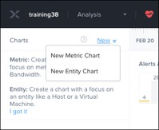
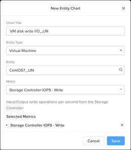
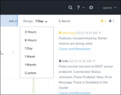
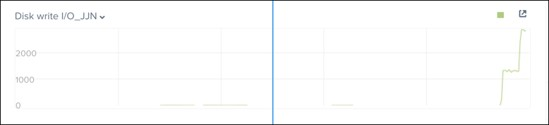
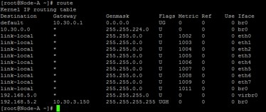
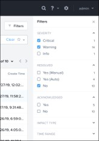
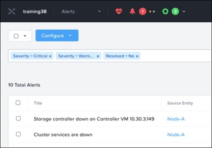
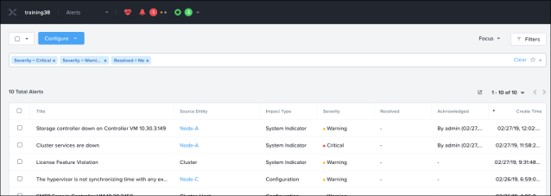
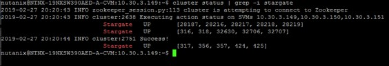
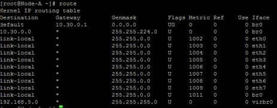
.. |image070| image:: images/img070.jpg
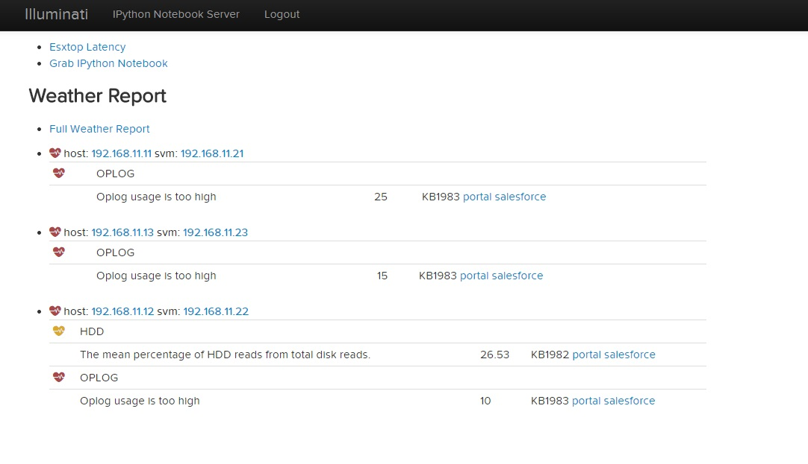
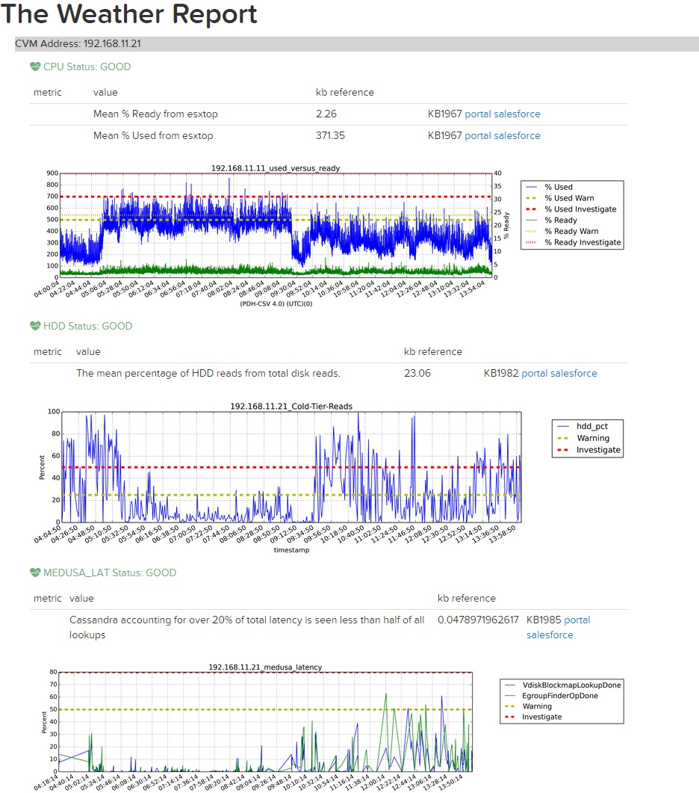
