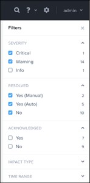

.. _lab5_healt_mintoring_and_alerts:

Lab 5
========

Exercise 1: Creating a Performance Chart
----------------------------------------

   **Individual Exercise**

   In this exercise you will create a performance chart to monitor VM disk I/O.

**1**. If you are not logged into your Prism UI, log on now as the **admin** user.

**2**. From the **dashboard** drop down menu, click **Analysis**.

**3**. In the upper left of the UI, click **New** and then click **New Entity Chart**. An entity can be a host, a VM, a container and so on.

..

   |image060|

**4**. Fill in the **New Entity Chart** fields as detailed in the following

   table:

=========== =================================
Chart Title VM Disk Write I/O-<your initials>
=========== =================================
Entity Type Virtual Machine
Entity      CentOS7-<your initials>
Metric      Storage Controller IOPS - Write
=========== =================================

**5**. When you are done, the **New Entity Chart** should look similar to the screenshot below:

..

   |image061|

**6**. Click **Save**.

**7**. Near the upper-right corner in the browser window, click the

   **Range** box and select **3 Hours**.

..

   |image062|

Exercise 2: Generating Write I/O
--------------------------------

   **Individual Exercise**

   In this exercise you will configure a CentOS VM to write data to its local disk using the Linux command dd and monitor write IOPS on the performance chart you created in the previous exercise.

**1**. Go to the **VM** dashboard and select the **Table** tab.

**2**. Select the **CentOS7-<your initials>** virtual machine. Power on the VM if necessary.

**3**. Click **Launch Console**.

**4**. Log on as the **root** user using the password **(See lab handout)**.

**5**. Generate I/O from the **CentOS7-<your initals>** virtual machine by entering the following command (enter all of the following on a single line with no line breaks):

..

 .. code-block:: bash

      for ((i=1;i<=100;i++)); do dd if=/dev/zero of=/root/bigfile bs=64k count=500000 oflag=direct; done

..

.. note::
 
      This command will write 500,000 64k blocks to the root directory repeating 100 times and takes from one to 10 hours to complete depending on the speed of the hardware you are using in the lab environment.

..

**6**. Go to the **Analysis** dashboard and view the **VM disk write I/O** graph. Refresh the URL to see the updated chart. You should see a green line to the far right sharply rise to denote the start of the dd operation. You can get a better view, shortening the time display, by going to the blue box at the top of the page and dragging the left side bar to the right to shorten the time sample.

..

   |image063|

**7**. After observing for several minutes, press **<Ctrl-c>** to stop theS writes. Close the console session.

Exercise 3: Managing Alerts 
---------------------------

   **Group Exercise**

   In this exercise you will work with your lab partner and use the **Alerts** dashboard to manage alerts. You can generate an alert by stopping the **Stargate** service. Once the Stargate service has stopped, an alert will be created and you can create an alert filter, then acknowledge and resolve the alert.

**1**. Using PuTTY, establish an SSH session to any Controller VM in your cluster. You can get the first Controller VM’s IP address from your lab handout. Log on as the **nutanix** user with the CVM password from your lab handout.

**2**. Stop the Stargate service by entering the following command:

..

 .. code-block:: bash

      cluster status (this output shows the status of all CVMs, scroll to review)

 .. code-block:: bash

      genesis stop stargate

**3**. Confirm the Stargate service has stopped by entering the following command:

..

 .. code-block:: bash

     cluster status | grep -iw down (or cluster status and scroll to review)

**4**. Log on as the **root** user on the **AHV** hypervisor by entering the following command:

..

 .. code-block:: bash

      ssh 192.168.5.1 -l root

5. Confirm **Data Path Redundancy** is in effect by observing a route specific to the **192.168.5.2** IP address in the hypervisor routing table (Data Path Redundancy takes effect whenever Stargate is not running). You can observe the route table by entering the following command:

..

 .. code-block:: bash

      route

..

   |image064|

   The last line in the above output will delay showing for approximately 30 seconds. This line represents Data Path Redundancy redirecting I/O operations on this node to another Controller VM.

**6**. Close the connection to the **AHV** hypervisor by entering the following command:

..

 .. code-block:: bash

   exit

.. note::

      Only type the exit command once, leaving the PuTTY window still connected to your Controller VM.

**7**.	In the **Prism** UI, switch to the **Alerts** dashboard.

**8**.	In the upper right corner of the UI, click **Filters**.

**9**.	Click to select both the **Critical** and **Warning** filter check boxes.

..

   |image065|

   A Stargate-specific alert is generated as Cluster services are down.

**10**. From **Prism**, on the **Alerts** dashboard, hover your mouse over **Cluster services are down** to reveal a hyperlink. Click the **Cluster services are down** alert hyperlink.

..

    |image066|

.. note::

      Notice several possible causes may be displayed in the Alerts detail window.

**11**. Acknowledge the alert by clicking **Acknowledge** (in the upper right corner of the browser window). You will see a **Successfully Acknowledged** message briefly appear in the top center of the browser window.

**12**. Click the **X** in the upper-right corner of the browser window to return to the **Alerts** dashboard.

**13**. After you have acknowledged the alert, you will see a user and timestamp have been added to the **Acknowledged** column in the **Alerts** dashboard for the alert.

..

   |image067|

**14**. Return to your secure SSH session (or reopen a session, if necessary, back to the first Controller VM in your cluster).

**15**. Restart Stargate by entering the following command:

..

 .. code-block:: bash

        genesis restart stargate

**16**. Confirm Stargate is running on all of your cluster’s nodes by entering the following command:

..

 .. code-block:: bash

         cluster status | grep -i stargate

   The output should indicate Stargate is up on all nodes. You may need to run the cluster status several times.

..

   |image068|

**17**. SSH to the **AHV** hypervisor by entering the following command:

..

 .. code-block:: bash

         ssh 92.168.5.1 -l root

**18**. Confirm the specific route for the **192.168.5.2** address (which the Data Path Redundancy feature added when Stargate was stopped) is no longer in the hypervisor route table by entering the following command:

..

 .. code-block:: bash

         route -n

After several minutes, the **192.168.5.2** line item will no longer show in the host’s route table.

..

   |image069|

**19**. Exit the PuTTY session.

**20**. From Prism on the **Alerts** dashboard, click the check box next to the **Cluster services are down** alert.

**21**. Click the **Resolve** button at the top of the UI to resolve this alert.

**22**. Do you see the **Cluster services are down** alert?

**23**. Under **Filters**, in the **RESOLVED** section, check the boxes next to **Yes (Manual)**, **Yes (Auto)** and **No**.

..

   |image070|

24. In the **Alerts** table you should now see all alerts, resolved and not resolved.

.. note::

   By default, resolved alerts are not displayed.

.. |image060| image:: images/img060.jpg

.. |image064| image:: images/img064.jpg

.. |image066| image:: images/img066.jpg
.. |image067| image:: images/img067.jpg
.. |image068| image:: images/img068.jpg

