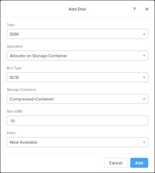
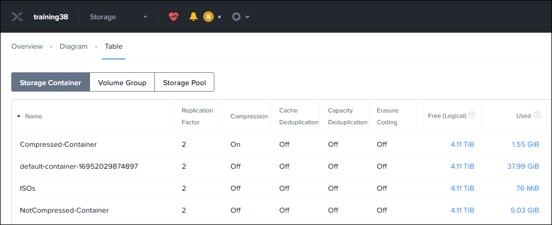

.. _lab6_distributed_storage_fabric:

Lab 6
========

Exercise 1: Creating a Container with Compression Enabled
---------------------------------------------------------

   **Group Exercise**

   In this exercise you will create a new storage container with compression enabled.

**1**. Log on to the **Prism** interface, if needed, and switch to the **Storage** dashboard.

**2**. On the **Storage** dashboard **Overview** page, examine the **Capacity Optimization** widget at the lower left. It will either show **There are no Capacity Optimization savings to show** or minimal optimization savings. This is because neither compression, deduplication, nor erasure coding has been enabled on any storage containers. Minimal savings may appear for the VMs created earlier, due to having thin provisioned disks.

..

   |image071|

**3**. In the upper-right corner of the browser window, click **+ Storage Container**.

**4**. In the **Create Storage Container** window, type: **Compressed-Container** in the **Name** field.

..

   |image072|

**5**. Click **Advanced Settings**.

**6**. Click the **Compression** check box and ensure that the **Delay in Minutes** field is set to **0**. This will enable compression on write.

..

   |image073|

**7**. Click **Save**.

Exercise 2: Creating a Container without Compression
----------------------------------------------------

   **Group Exercise**

   In this exercise you will create a new storage container without compression.

**1**. In the upper right corner of the browser window, click **+ Storage Container**.

**2**. In the **Create Storage Container** window, type: **NotCompressed-Container** in the **Name** field.

**3**. Click **Save**.

.. note::

    Do not change anything within advanced settings. 

Exercise 3: Comparing Data in a Compressed vs Uncompressed Container
--------------------------------------------------------------------

   **Individual Exercise**

   In this exercise you will work individually to clone your original Windows VM and add two virtual disks. One of these virtual disks will be placed in the compressed container and the other into the uncompressed container you created in the previous exercises. Data will be generated on both virtual disks to compare results.

   This exercise is composed of the following tasks:

        * Cloning a VM and add Two Virtual Disks

        * Formatting the New Virtual Disks

        * Writing a Large File to Each New Virtual Disk

        * Observing the Result of Compression Savings

Task 1: Adding Two Virtual Disks to a Virtual Machine 
~~~~~~~~~~~~~~~~~~~~~~~~~~~~~~~~~~~~~~~~~~~~~~~~~~~~~

   **Individual Exercise**

   In this task you will clone your original Windows VM and add two virtual disks. One virtual disk will be placed in the **Compressed-Container** and the other into the **NotCompressed-Container**.

**1**. From the **VM** dashboard, **Table** view, clone your **Windows-<your initials>** VM.

        a. Select the VM and click the **Clone** link.

        b. Change the name of the clone to **DSF-<your initials>** and click **Save**.

**2**. Power on the new VM.

**3**. Dynamically add a new disk. Select the new VM and click the **Update** link from the option below the virtual machine table and scroll down to the **Disks** section.

**4**. Click **+ Add New Disk**.

**5**. Use the following table to complete the **Add Disk** dialog box:

================= =================================
Type              **DISK**
================= =================================
Operation         **Allocate on Storage Container**
Bus Type          **SCSI**
Storage Container **Compressed-Container**
Size (GiB)        **10**
Index             **Next Available**
================= =================================

**6**. Click **Add**.

..

   |image074|

**7**. Repeat the previous steps to add a second **10GB** virtual disk to the virtual machine with the second virtual disk placed into the **NotCompressed-Container**.

**8**. Click **Save**.

**9**. Scroll down (if required) in the **VM** dashboard and at the lower left, under **VM DETAILS**, verify the VM is utilizing three containers:

        * **Default**

        * **Compressed-Container**

        * **NotCompressed-Container**

Task 2: Formatting the New Virtual Disks 
~~~~~~~~~~~~~~~~~~~~~~~~~~~~~~~~~~~~~~~~

   **Individual Exercise**

   In this task you will format the newly added virtual disks in your Windows virtual machine so that you can write a large file to each of the new virtual disks.

**1**. Select your **DSF-<your initials>** VM and click **Launch Console**.

**2**. In the upper right corner of the virtual machine console window, click the **Ctl-Alt-Del** icon to log on to your virtual machine as **Administrator** with the password **(See lab handout)**.

**3**. Start the Windows Server Manager by clicking the **toolbox** icon immediately to the right of the **Windows Start** button (four pane glass). Click **File** **and** **Storage Services** in the left panel.

..

   |image075|

**4**. Click **Disks**.

..

   |image076|

**5**. Right-click one of the **10GB** disks and select **Bring Online**.

..

   |image077|

**6**. Click **Yes** in the **Bring Disk Online** warning window.

**7**. Repeat the previous steps to bring the second **10GB** disk online. 8. Right-click the first **10GB** disk and select **New Volume…**

..

   |image078|

**9**.  Complete the **New Volume** wizard as follows:

        a. In **Before You begin**, click **Next**.

        b. In **Select the server and disk**, click **Next**.

        c. In the **Offline or Uninitialized Disk** warning window, click **OK**.

        d. In **Specify the size of the volume**, click **Next**.

        e. In **Assign to a** **drive letter or folder**, note the assigned drive letter (you will need this later) and click **Next**.

        f. In **Select** **File System Settings**, click **Next**.

        g. In **Confirm selections**, click **Create**.

        h. When the new volume creation has completed, click **Close**.

**10**. Repeat the above steps for the second 10GB disk (again noting its assigned drive letter). When you are finished, both 10GB disks should have their status **Online** and have **GPT** partitions.

..

   |image079|

**11**. Close the **Server Manager** window.

Task 3: Writing a Large File to Each New Virtual Disk 
~~~~~~~~~~~~~~~~~~~~~~~~~~~~~~~~~~~~~~~~~~~~~~~~~~~~~

   **Individual Exercise**

   In this task you will download the **Cubic Design Tools** to the windows server. You will then use Cubic Design Disk Tool to write a large file to each of the new disks.

      * Enable Remote Desktop on the windows Server and connect using user .\\\\administrator and the <password>

**1**. open the iExplorer and past the link http://www.soft.tahionic.com/download/CubicDesign_tools.exe

**2**. When the file is donwnloadet install it

**3**. go to the direcory C:\\\\Tahionic tools package\\\\System & security and start "Disk Tools"

   |image080|

**17**. In the **File Generator** window, make sure the **File Generator** tab is selected and complete the fields as follows (leave any fields not mentioned below in their default state):

+-----------------------------+---------------------------------------+
| Number of Files             | **1 (one)**                           |
+=============================+=======================================+
| File Size                   | **5 GB**                              |
+-----------------------------+---------------------------------------+
| File Name: Name             | Any name of your choosing             |
+-----------------------------+---------------------------------------+
| File Name: Output Folder    | Enter the drive letter from the first |
|                             | disk you added to the VM (for         |
|                             | example, **E:\\**)                    |
+-----------------------------+---------------------------------------+
| File Content: radio buttons | **Fill the Files with this content:** |
+-----------------------------+---------------------------------------+
| File Content: text box      | Enter any single character of your    |
|                             | choosing                              |
+-----------------------------+---------------------------------------+

..

   When you are done, the **File Generator** window should look like the following screenshot (your specific drive letter may be different from the screenshot):

   |image081|

**18**. Click **Create**. This process should take less than a minute to complete. You will see a **Done** notice at the bottom of the **File Generator** window when the file creation has completed.

**19**. Repeat the previous steps to create a large file on the second virtual disk drive you added to your virtual machine.

**20**. Close the **File Generator** window.

**21**. In **Windows File Explorer** examine the size of the two disks you added to your virtual machine along with the amount of free space on each drive. You should notice Windows is showing that approximately **5GB** of space is used on each virtual disk indicating the Windows virtual machine is completely unaware of any compression happening in the Nutanix Distributed Storage Fabric on the back end.

..

   |image082|

Task 4: Observing the Result of Compression Savings 
~~~~~~~~~~~~~~~~~~~~~~~~~~~~~~~~~~~~~~~~~~~~~~~~~~~

   **Individual Exercise**

   In this task you will observe the result of container compression.

**1**. Switch to the **Storage** dashboard and click the **Overview** tab.

**2**. Examine the **Capacity Optimization** widget in the lower left corner of the UI.

..

   Do you see any immediate savings reported?

.. note::

    Note: The savings display can take up to a few hours to display. If you do not see an immediate result, come back to this dashboard later to verify the savings due to compression.

**3**. Click **Table**, then select **Storage Container**.

**4**. For the **Compressed-Container** and the **NotCompressed-Container**, look in the **Used** column and compare the amount of physical space used.

..

   Do you see a difference?

   The **Compressed-Container** should be using significantly less space than the **NotCompressed-Container**.

   |image083|

**5**. Click to select the **Compressed-Container**.

**6**. Below the table of containers, on the left of the browser window, examine the values below the **Summary > Compressed-Container** box and answer the following questions:

..

   Is compression turned on?

   How much space has been saved due to compression?

.. note::

    You may have to wait a few hours for a value to appear in this field. 

..

   What is the current Data Reduction Ratio?

   What is the difference between the Compressed-Container and the NotCompressedContainer for the Data Reduction Ratio?

..

.. |image078| image:: images/img078.jpg

