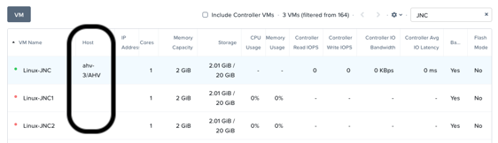

.. _lab7_data_protection:

Lab 7
---------------------

Overview
++++++++

Nutanix provides the ability to perform VM/vDisk-level storage snapshots. Protection Domains (PDs) are the construct for grouping VMs and applying snapshot and replication policies.

In this exercise you will use Prism to create and restore from VM snapshots, as well as create a Protection Domain for your VMs.

Data Protection
+++++++++++++++

VM Snapshots
............

**1**. In **Prism Element > VM > Table**, select your **Linux_VM**-*Initials* VM.

**2**. If the VM is powered on, perform a **Guest Shutdown** power action.

   |image003|

**3**. Select the VM and click **Take Snapshot** from the menu below the table.

   |image004|

---------------------

   |image005|

**4**. Provide a name for your snapshot and click **Submit**.

**5**. Select the **VM Snapshots** tab below the table to view the available snapshots for the selected VM.

   |image006|

**6**. Under **Actions**, click **Details** to see all of the VM’s properties at the time of the snapshot.

   You can see the snapshot contains VM state in addition to just its data.

   *Now it's time to break your VM!*

**7**. Click **Update** to modify your VM and remove both the CD-ROM and DISK by clicking the **X** icon for each item.

   |image007|

**8**. Click **Save**.

**9**. Attempt to power on the VM and launch its console window.

   Note that the VM no longer has any disks from which to boot and that the 2048 game is displayed.

   |image008|

**10**. Power off the VM.

**11**. Under **VM Snapshots**, select your snapshot and click **Restore** to revert the VM to a functioning state.

   Alternatively you can click **Clone** to restore to a new VM.

**12**. Verify that the VM boots successfully.

As previously mentioned, Nutanix snapshots use a `redirect-on-write <https://nutanixbible.com/#anchor-book-of-acropolis-snapshots-and-clones>`_ approach that does not suffer from the performance degradation of chained snapshots found in other hypervisors.

Protection Domains
..................

**1**. In **Prism Element > Data Protection > Table**, click **+ Protection Domain > Async DR** to begin creating a PD.

   |image009|

------------------------

   |image010|

   .. note::

      Synchronous replication (Metro Availability) is currently support on ESXi and will be supported in AHV in a future release.

**2**. Provide a name for the PD, and click **Create**.

   |image011|

**2**. Filter or scroll to select the VMs created during this lab that you want to add to the PD.

   |image012|

**3**. Click **Protect Selected Entities** and verify the VMs appear under **Protected Entities**.

   Consistency groups allow you to group multiple VMs to be snapshot at the same time, e.g. multiple VMs belonging to the same application.

   .. note:: Nutanix snapshots can perform application consistent snapshots for supported operating systems with NGT installed. Each VM using application consistent snapshots will be part of its own consistency group.

**4**. Click **Next**.

**5**. Click **New Schedule** to define Recovery Point Objective (RPO) and retention.

**6**. Configure your desired snapshot frequency (e.g. Repeat every 1 hour)

   |image013|

   .. note::

      AHV supports NearSync snapshots, with RPOs as low as 1 minute.

   .. note::

      Multiple schedules can be applied to the same PD, allowing you to take and retain X number of hourly, daily, monthly snapshots.

**7**. Configure a retention policy (e.g. Keep the last 6 snapshots)

-------------------------------------------

   .. note::

      For environments with remote cluster(s) configured, setting up replication is as easy as defining how many snapshots to keep at each remote site.

   |image002|

**8**. Click **Create Schedule**.

**9**. Click **Close** to exit.

That's it! You've successfully configured native data protection in Prism.

Takeaways
+++++++++

- Nutanix offers data protection solutions for virtual datacenters via different strategies including one-to-one or one-to-many replication.
- Nutanix provides data protection functions at the VM, file, and volume group level, so VMs and data remain safe in a crash-consistent environment.
- VM-level snapshot and replication policies can be managed through Prism for any supported hypervisor.

.. |image002| image:: images/img040.png

