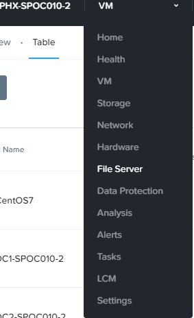
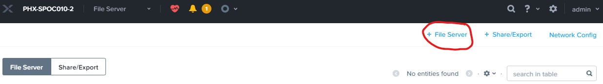
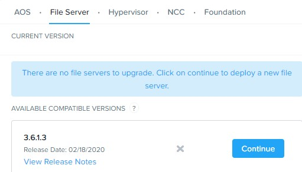
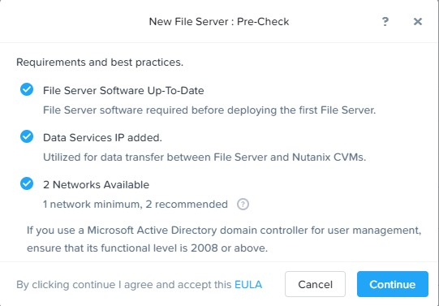
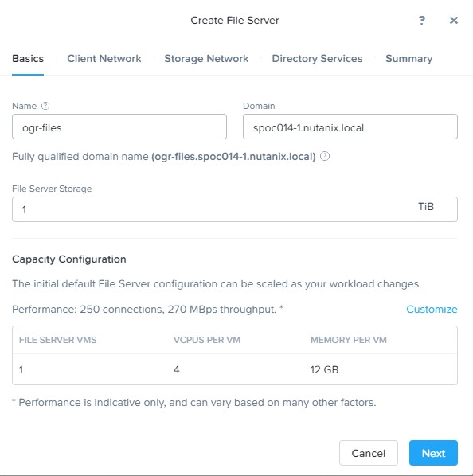
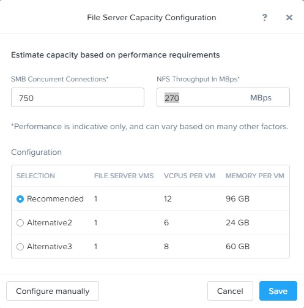
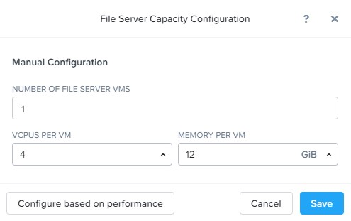
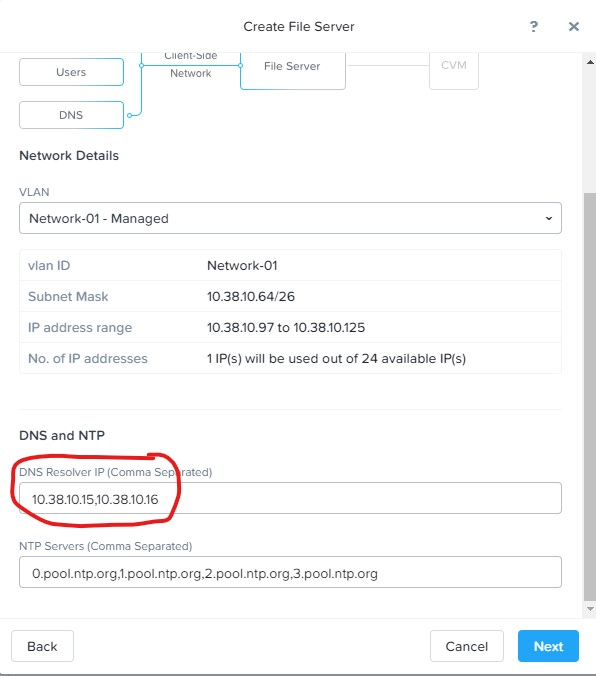
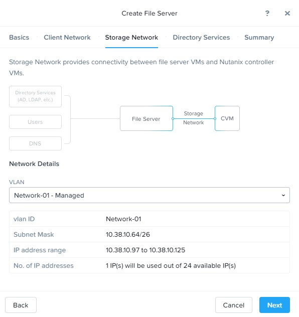

.. _lab7_files_deploy:

Lab 7
-------------

*Estimated time to complete all Files labs: 1 HOUR*

Overview
++++++++

Traditionally, file storage has been yet another silo within IT, introducing unnecessary complexity and suffering from the same issues of scale and lack of continuous innovation seen in SAN storage. Nutanix believes there is no room for silos in the Enterprise Cloud. By approaching file storage as an app, running in software on top of a proven HCI core, Nutanix Files  delivers high performance, scalability, and rapid innovation through One Click management.

**In this lab you will step through a Files deployment, manage SMB shares and NFS exports, scale out the environment, and explore upcoming Files features. The lab will provide key considerations around deployment, configuration, and use cases.**

.. _deploying_files:

Lab Setup
+++++++++

This lab requires applications provisioned as part of the Lab 4

Deploy Files
++++++++++++

#. In **Prism > File Server**, click **+ File Server** to open the **New File Server Pre-Check** dialogue.

   |image085|

..

   |image086|

For the purpose of saving time, the Files package has already been uploaded to your cluster. Files binaries can be downloaded directly through Prism or uploaded manually.

   |image087|

Additionally, the cluster's **Data Services** IP Address has already been configured (*10.xx.xx.72*). In a Files cluster, storage is presented to the Files VMs as a Volume Group via iSCSI, hence the dependency on the Data Services IP.

   .. note::

     If staging your own environment, the Data Services IP can be easily configured by selecting **Settings** **> Cluster Details**, specifying the **iSCSI Data Services IP**, and clicking **Save**. Currently, the Data Services IP must be in the same subnet as your CVMs.

   Lastly Files will ensure that at least 1 network has been configured on the cluster. A minimum of 2 networks are recommended to have segmentation between the client side and storage side networks.

#. Click **Continue**.

   |image088|

#. Fill out the following fields:

   - **Name** - *Intials*-Files (e.g. XYZ-Files)
   - **Domain** - ntnxlab.local
   - **File Server Size** - 1 TiB

..

   |image089|

..

   .. note::

     Clicking **Custom Configuration** will allow you to alter the scale up and scale out sizing of the Files VMs based on User and Throughput targets. It also allows for manual sizing of the Files cluster.

     |image090|
     |image091|

#. Click **Next**.

#. Select the **Network-01** VLAN for the **Client Network**.

   Each Files VM will consume a single IP on the client network.

   .. note::

     In the HPOC environment it is critical to use the secondary VLAN for the client network if using separate client and storage networks.

     It is typically desirable in production environments to deploy Files with dedicated virtual networks for client and storage traffic. When using two networks, Files will, by design, disallow client traffic the storage network, meaning VMs assigned to the primary network will be unable to access shares.

   .. note::

     As this is an AHV managed network, configuration of individual IPs is not necessary. In an ESXi environment, or using an unmanaged AHV network, you would specify the network details and available IPs as shown below.

     .. figure:: images/6.png

#. Specify your cluster's **Domain Controller** VM IP (found in :ref:`stagingdetails`) as the **DNS Resolver IP** (e.g. 10.XX.YY.40). Leave the default (cluster) NTP Server.

   .. raw:: html

     <strong>In order for the Files cluster to successfully find and join the NTNXLAB.local domain it is critical that the DNS Resolver IP is set to the Domain Controller VM IP FOR YOUR CLUSTER. By default, this field is set to the primary Name Server IP configured for the Nutanix cluster, this value is incorrect and will not work.</strong>

..

     |image092|

#. Click **Next**.

#. Select the **Primary - Managed** VLAN for the Storage Network.

   Each Files VM will consume a single IP on the storage network, plus 1 additional IP for the cluster.

   .. figure:: images/8.png

#. Click **Next**.

#. Fill out the following fields:

   - Select **Use SMB Protocol**
   - **Username** - Administrator@ntnxlab.local
   - **Password** - nutanix/4u
   - Select **Make this user a File Server admin**
   - Select **Use NFS Protocol**
   - **User Management and Authentication** - Unmanaged

   .. figure:: images/9.png

   .. note:: In unmanaged mode, users are only identified by UID/GID. In Files 3.5, Files supports both NFSv3 and NFSv4

#. Click **Next**.

   By default, Files will automatically create a Protection Domain to take daily snapshots of the Files cluster and retain the previous 2 snapshots. After deployment, the snapshot schedule can be modified and remote replication sites can be defined.

   .. figure:: images/10.png

#. Click **Create** to begin the Files deployment.

#. Monitor deployment progress in **Prism > Tasks**.

   Deployment should take approximately 10 minutes.

   .. figure:: images/11.png

   .. note::

     If you receive a warning regarding DNS record validation failure, this can be safely ignored. The shared cluster does not use the same DNS servers as your Files cluster, and as a result is unable to resolve the DNS entries created when deploying Files.

#. While waiting for the file server deployment, if you have not already done so deploy the Windows Tools VM.

#. Connect to the Windows Tools VM via RDP or console

#. Download the sample files for File Analytics to the Tools VM:

   - `https://peerresources.blob.core.windows.net/sample-data/SampleData_Small.zip <https://peerresources.blob.core.windows.net/sample-data/SampleData_Small.zip>`_

#. Download the File Analytics json and qcow files to the Tools VM

   - `nutanix-file-analytics-2.0.0-metadata.json <http://10.42.194.11/workshop_staging/fileanalytics-2.0.0.json>`_
   - `nutanix-file-analytics-2.0.0.qcow2 <http://10.42.194.11/workshop_staging/nutanix-file_analytics-el7.6-release-2.0.0.qcow2>`_

#. Upon completion, return to **Prism > File Server** and select the *Initials*\ **-Files** server and click **Protect**.

   .. figure:: images/12.png

#. Observe the default Self Service Restore schedules, this feature controls the snapshot schedule for Windows' Previous Versions functionality. Supporting Previous Versions allows end users to roll back changes to files without engaging storage or backup administrators. Note these local snapshots do not protect the file server cluster from local failures and that replication of the entire file server cluster can be performed to remote Nutanix clusters. Click **Close**.

   .. figure:: images/13.png

Takeaways
+++++++++

What are the key things you should know about **Nutanix Files**?

- Files can be rapidly deployed on top of existing Nutanix clusters, providing SMB and NFS storage for user shares, home directories, departmental shares, applications, and any other general purpose file storage needs.
- Files is not a point solution. VM, File, Block, and Object storage can all be delivered by the same platform using the same management tools, reducing complexity and management silos.

..

.. |image094| image:: images/img094.jpg
.. |image095| image:: images/img095.jpg
.. |image096| image:: images/img096.jpg
.. |image097| image:: images/img097.jpg