.. _lab8_files_smb_share:

Lab 9
----------------------------

Overview
++++++++

In this exercise you will create and test a SMB share, used to support home directories, user profiles, and other unstructured file data such as departmental shares commonly accessed by Windows clients.

Using SMB Shares
++++++++++++++++

Creating the Share
..................

#. In **Prism > File Server**, click **+ Share/Export**.

#. Fill out the following fields:

   - **Name** - Marketing
   - **Description (Optional)** - Departmental share for marketing team
   - **File Server** - *Initials*\ **-Files**
   - **Share Path (Optional)** - Leave blank. This field allows you to specify an existing path in which to create the nested share.
   - **Max Size (Optional)** - Leave blank. This field allows you to set a hard quota for the individual share.
   - **Select Protocol** - SMB

   |image095|

#. Click **Next**.

#. Select **Enable Access Based Enumeration** and **Self Service Restore**.

   |image096|

   As you are creating a departmental share, it should be created as a **Standard** share. This means that all top level directories and files within the share, as well as connections to the share, are served from a single Files VM.

   **Distributed** shares are appropriate for home directories, user profiles, and application folders. This type of share shards top level directories across all Files VMs and load balances connections across all Files VMs within the Files cluster.

   **Access Based Enumeration (ABE)** ensures that only files and folders which a given user has read access are visible to that user. This is commonly enabled for Windows file shares.

   **Self Service Restore** allows users to leverage Windows Previous Version to easily restore individual files to previous revisions based on Nutanix snapshots.

#. Click **Next**.

#. Review the **Summary** and click **Create**.

   |image097|
   |image098|

Testing the Share
.................

#. Connect to your **WindowsVM** via RDP or console.

   .. note::

     The VM has already been joined to the **<POCname>.nutanix.local** domain. You could use any domain joined VM to complete the following steps.

#. Open ``\\<Intials>-Files.<POCname>.nutanix..local\`` in **File Explorer**.

   |image099|

#. Test accessing the Marketing share by extracting the SampleData_Small.zip files downloaded in the previous step into the share.

   |image100|

   - The **<POCname>.nutanix.local\\Administrator** user was specified as a Files Administrator during deployment of the Files cluster, giving it read/write access to all shares by default.
   - Managing access for other users is no different than any other SMB share.

#. Right-click **Marketing > Properties**.

#. Select the **Security** tab and click **Advanced**.

   |image101|

#. Select **Users (**\ *Initials*\ **-Files\\Users)** and click **Remove**.

#. Click **Add**.

#. Click **Select a principal** and specify **Everyone** in the **Object Name** field. Click **OK**.

   |image102|

#. Fill out the following fields and click **OK**:

   - **Type** - Allow
   - **Applies to** - This folder only
   - Select **Read & execute**
   - Select **List folder contents**
   - Select **Read**
   - Select **Write**

   |image103|

#. Click **OK > OK > OK** to save the permission changes.

   All users will now be able to create folders and files within the Marketing share.

   It is common for shares utilized by many people to leverage quotas to ensure fair use of resources. Files offers the ability to set either soft or hard quotas on a per share basis for either individual users within Active Directory, or specific Active Directory Security Groups.

#. In **Prism > File Server > Share > Marketing**, click **+ Add Quota Policy**.

#. Fill out the following fields and click **Save**:

   - Select **Group**
   - **User or Group** - SSP Developers
   - **Quota** - 10 GiB
   - **Enforcement Type** - Hard Limit

   |image104|

#. Click **Save**.

#. With the Marketing share still selected, review the **Share Details**, **Usage** and **Performance** tabs to understand the available on a per share basis, including the number of files & connections, storage utilization over time, latency, throughput, and IOPS.

   |image105|

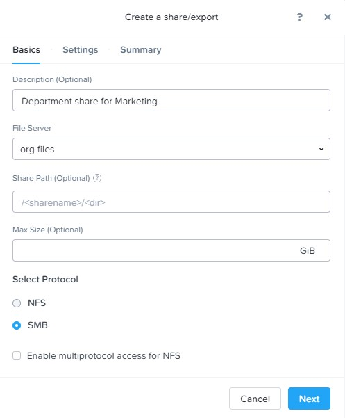
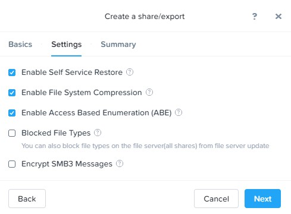
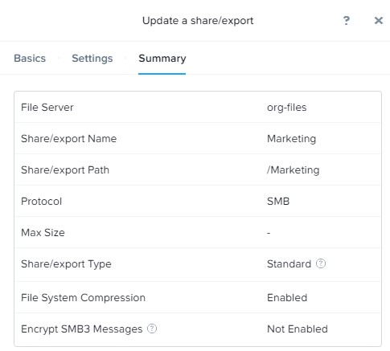
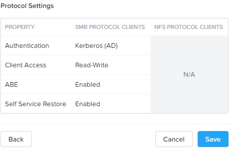
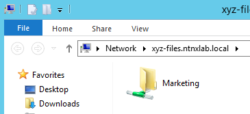
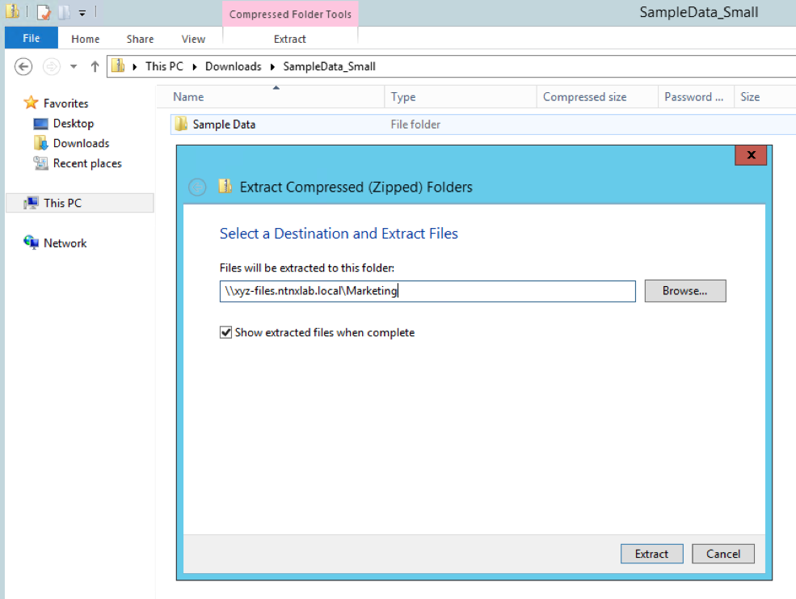
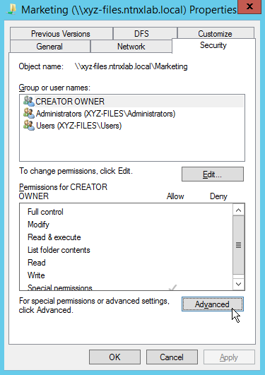
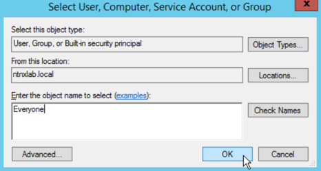
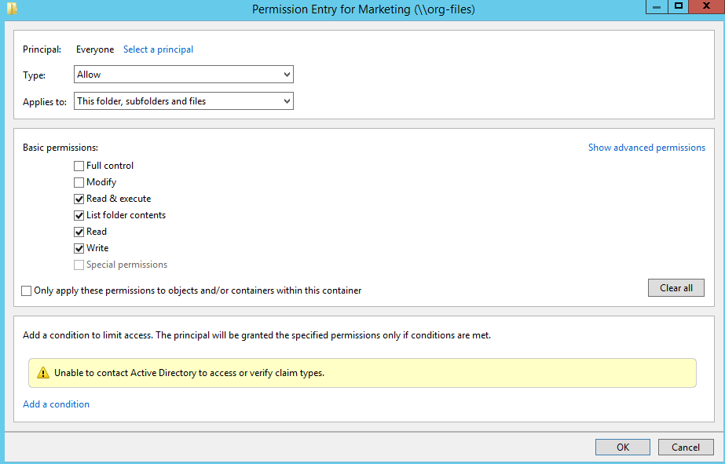
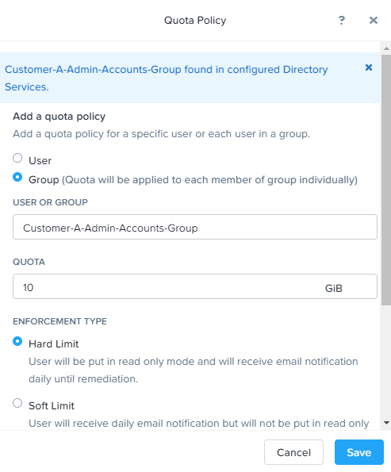
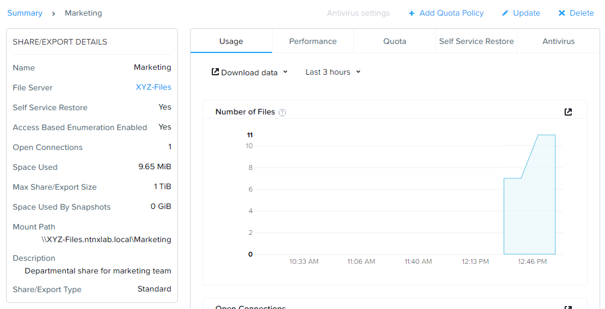